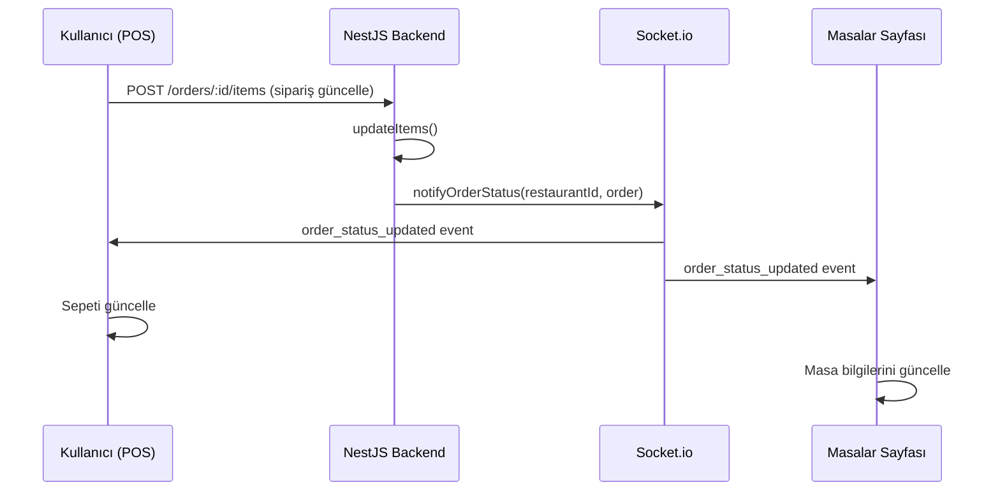

# Real-Time POS & Tables Entegrasyon Planı

## Mevcut Durum Analizi

### Backend (Socket.io Gateway)
- `NotificationsGateway` çalışıyor ve event emit ediyor
- `notifyNewOrder(restaurantId, order)` → `new_order` event
- `notifyOrderStatus(restaurantId, order)` → `order_status_updated` event
- Room-based: Restaurant ID'ye göre room'lara katılım

### Frontend
- `socket.io-client` yüklü ama kullanılmıyor
- Real-time entegrasyon yok

---

## Planlanan Değişiklikler

### Adım 1: Socket Servisi Oluştur
```
web/modules/shared/api/socket.ts
```
- Singleton socket instance
- Restaurant room'una katılma/çıkma
- Event listeners

### Adım 2: TablesClient Güncelle
```
web/modules/tables/components/TablesClient.tsx
```
- Socket bağlantısı kur
- `order_status_updated` event'ini dinle
- Gelen order verisine göre:
  - Masa durumunu güncelle (occupied/available)
  - Toplam tutarı güncelle
  - Aktif sipariş sayısını güncelle

### Adım 3: OrdersClient (POS) Güncelle
```
web/modules/orders/components/OrdersClient.tsx
```
- Socket bağlantısı kur
- `order_status_updated` event'ini dinle
- Aynı masadaki sipariş güncellendiğinde:
  - Sepeti yeniden yükle
  - UI'ı refresh et

---

## Detaylı Implementasyon

### 1. Socket Service

```typescript
// web/modules/shared/api/socket.ts
import { io, Socket } from 'socket.io-client'
import { create } from 'zustand'

interface SocketState {
  socket: Socket | null
  isConnected: boolean
  connect: (restaurantId: string) => void
  disconnect: () => void
  emit: (event: string, data: any) => void
  on: (event: string, callback: (data: any) => void) => void
  off: (event: string) => void
}

export const useSocketStore = create<SocketState>((set, get) => ({
  socket: null,
  isConnected: false,
  
  connect: (restaurantId) => {
    if (get().socket?.connected) return
    
    const socket = io(process.env.NEXT_PUBLIC_API_URL || 'http://localhost:3001', {
      transports: ['websocket'],
    })
    
    socket.on('connect', () => {
      socket.emit('join_room', { restaurant_id: restaurantId })
      set({ isConnected: true })
    })
    
    socket.on('disconnect', () => {
      set({ isConnected: false })
    })
    
    set({ socket })
  },
  
  disconnect: () => {
    get().socket?.disconnect()
    set({ socket: null, isConnected: false })
  },
  
  emit: (event, data) => get().socket?.emit(event, data),
  
  on: (event, callback) => get().socket?.on(event, callback),
  
  off: (event) => get().socket?.off(event),
}))
```

### 2. TablesClient Entegrasyonu

```typescript
// TablesClient.tsx
'use client'

import { useEffect } from 'react'
import { useSocketStore } from '@/modules/shared/api/socket'
import { useTablesStore } from './store' // Varsayılan store

export function TablesClient({ restaurantId, initialAreas, initialTables }) {
  const { connect, on, off } = useSocketStore()
  const { updateTableFromOrder } = useTablesStore()
  
  useEffect(() => {
    connect(restaurantId)
    
    // Order güncellendiğinde masaları güncelle
    const handleOrderUpdate = (order: any) => {
      if (order.tableId) {
        updateTableFromOrder(order)
      }
    }
    
    on('order_status_updated', handleOrderUpdate)
    on('new_order', handleOrderUpdate)
    
    return () => {
      off('order_status_updated')
      off('new_order')
    }
  }, [restaurantId])
  
  // ... mevcut render
}
```

### 3. Store Güncelleme

```typescript
// useTablesStore.ts (veya yeni)
updateTableFromOrder: (order) => set((state) => {
  const tableIndex = state.tables.findIndex(t => t.id === order.tableId)
  if (tableIndex === -1) return state
  
  const updatedTables = [...state.tables]
  const table = { ...updatedTables[tableIndex] }
  
  // Sipariş durumuna göre masa durumunu güncelle
  const activeStatuses = ['pending', 'preparing', 'ready', 'served']
  const hasActiveOrder = activeStatuses.includes(order.status)
  
  if (hasActiveOrder) {
    table.status = TableStatus.OCCUPIED
    table.currentOrderTotal = order.totalAmount
    table.activeOrderCount = (table.activeOrderCount || 0) + 1
  } else {
    table.status = TableStatus.AVAILABLE
    table.currentOrderTotal = 0
  }
  
  updatedTables[tableIndex] = table
  return { tables: updatedTables }
})
```

### 4. POS Client Entegrasyonu

```typescript
// OrdersClient.tsx
useEffect(() => {
  if (!restaurantId) return
  
  connect(restaurantId)
  
  const handleOrderUpdate = (updatedOrder: any) => {
    // Aynı masadaki sipariş güncellenmiş
    if (updatedOrder.tableId === selectedTable?.id) {
      // Sepeti yeniden yükle
      if (updatedOrder.items) {
        setBasketForTable(selectedTable.id, mapOrderItemsToBasket(updatedOrder.items))
      }
    }
    // Farklı masadaki sipariş güncellenmiş
    else if (existingOrder && updatedOrder.id === existingOrder.id) {
      // Mevcut sipariş başka bir yerden güncellenmiş, sepete yansıt
      if (updatedOrder.items) {
        setBasketForTable(selectedTable.id, mapOrderItemsToBasket(updatedOrder.items))
      }
    }
  }
  
  on('order_status_updated', handleOrderUpdate)
  
  return () => {
    off('order_status_updated')
  }
}, [restaurantId, selectedTable?.id, existingOrder?.id])
```

---

## Event Akışı



---

## Yapılacaklar Sırası

1. **Socket service oluştur** (`web/modules/shared/api/socket.ts`)
2. **TablesClient'a socket entegrasyonu ekle**
3. **Tables store'a updateTableFromOrder ekle**
4. **OrdersClient'a socket entegrasyonu ekle**
5. **Test et**

---

## Environment Variables

```bash
# .env.local
NEXT_PUBLIC_API_URL=http://localhost:3001  # Backend socket port
```

Not: Backend'in 3001 portunda çalışması gerekiyor (şu anda 3000'de olabilir, kontrol et)
