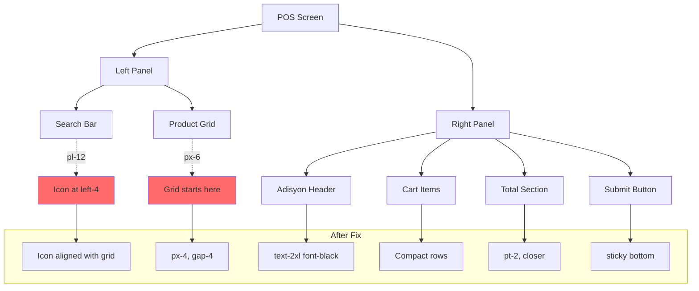

# POS Screen Visual Hierarchy & Alignment Fix Plan

## Current Issues Analysis

### Issue 1: Product Grid and Search Bar Alignment

**Current State:**
- Search bar in [`OrdersClient.tsx`](web/modules/orders/components/OrdersClient.tsx:217-229) has `pl-12` (48px padding-left)
- Search icon at `left-4` (16px) + icon size (16px) = starts at ~32px from container edge
- Grid container in [`PosProductGrid.tsx`](web/modules/orders/components/PosProductGrid.tsx:61-62) has `px-6` (24px padding)
- Grid gap is `gap-6` (24px)

**Problem:** Grid doesn't align with search icon vertically, and right edge of last card doesn't align with search bar's right edge.

**Fix:**
- Change grid container padding from `px-6` to `px-4` to align with search bar content area
- Ensure grid columns calculate to match search bar width

---

### Issue 2: Adisyon (Right Basket Panel) Layout

**Current State in [`PosBasket.tsx`](web/modules/orders/components/PosBasket.tsx):**
- Header "ADİSYON": `text-sm font-black` (line 61)
- "POS TERMİNALİ": `text-2xl font-black` in [`PosSubHeader.tsx`](web/modules/orders/components/PosSubHeader.tsx:37)
- Product items: flex row with `gap-2`, items spread across line (lines 87-129)
- Total section: `py-3` padding, too far from list (lines 134-151)
- Submit button: in flex container, not sticky (lines 153-178)

**Problems:**
1. "ADİSYON" title is much smaller than "POS TERMİNALİ"
2. Product names, prices, and quantity buttons not compact in same row
3. Total section too far from cart list
4. Submit button not sticky at bottom

**Fix:**
1. Change "ADİSYON" to `text-2xl font-black` to match "POS TERMİNALİ"
2. Make product item row more compact: name left, price + controls right
3. Remove/reduce padding before total section
4. Make submit button sticky with `sticky bottom-0`

---

### Issue 3: Card Content Badge and Price Styling

**Current State in [`PosProductGrid.tsx`](web/modules/orders/components/PosProductGrid.tsx:114-139) and [`PosProductCard.tsx`](web/modules/orders/components/PosProductCard.tsx:63-98):**
- Badge positioned inline with product name (lines 114-128 in Grid, 63-78 in Card)
- Price: `text-base font-semibold` 
- "BİRİM FİYAT": `text-[9px]` with `mb-0.5` margin

**Problems:**
1. "SATIŞTA" badge is inline with text, not at top-right corner
2. Price font slightly too large
3. Vertical spacing between label and price not standardized

**Fix:**
1. Move badge to absolute position at top-right of card with padding
2. Change price to `text-sm font-semibold`
3. Standardize spacing with `gap-1` instead of `mb-0.5`

---

## Detailed Code Changes

### File 1: [`OrdersClient.tsx`](web/modules/orders/components/OrdersClient.tsx)

**Lines 215-229 - Search Bar Container:**
```typescript
// CURRENT (lines 215):
<div className="bg-bg-surface border border-border-light p-6 space-y-6">

// CHANGE TO:
<div className="bg-bg-surface border border-border-light px-4 py-6 space-y-6">
```

### File 2: [`PosProductGrid.tsx`](web/modules/orders/components/PosProductGrid.tsx)

**Lines 61-62 - Grid Container:**
```typescript
// CURRENT:
<div className="flex-1 overflow-y-auto px-6 pt-6 bg-bg-app">

// CHANGE TO:
<div className="flex-1 overflow-y-auto px-4 pt-4 bg-bg-app">
```

**Lines 62 - Grid Gap:**
```typescript
// CURRENT:
<div className="grid grid-cols-2 sm:grid-cols-2 lg:grid-cols-3 xl:grid-cols-4 gap-6">

// CHANGE TO:
<div className="grid grid-cols-2 sm:grid-cols-2 lg:grid-cols-3 xl:grid-cols-4 gap-4">
```

**Lines 114-129 - Badge Position:**
```typescript
// CURRENT:
<div className="flex justify-between items-start gap-2 mb-1">
  <h3 className="text-base font-bold text-text-primary uppercase tracking-tight truncate leading-tight">
    {product.name}
  </h3>
  <div className="flex gap-1 shrink-0">
    {product.is_available ? (
      <span className="bg-success-main text-text-inverse text-[8px] font-black uppercase px-1.5 py-0.5 rounded-sm">
        SATIŞTA
      </span>
    ) : (
      <span className="bg-danger-main text-text-inverse text-[8px] font-black uppercase px-1.5 py-0.5 rounded-sm">
        KAPALI
      </span>
    )}
  </div>
</div>

// CHANGE TO (move badge to absolute position):
<div className="relative">
  {/* Badge at top-right */}
  <div className="absolute top-0 right-0">
    {product.is_available ? (
      <span className="bg-success-main text-text-inverse text-[8px] font-black uppercase px-1.5 py-0.5 rounded-sm">
        SATIŞTA
      </span>
    ) : (
      <span className="bg-danger-main text-text-inverse text-[8px] font-black uppercase px-1.5 py-0.5 rounded-sm">
        KAPALI
      </span>
    )}
  </div>
  {/* Product name without inline badge */}
  <h3 className="text-base font-bold text-text-primary uppercase tracking-tight truncate leading-tight pr-16">
    {product.name}
  </h3>
</div>
```

**Lines 133-139 - Price Section:**
```typescript
// CURRENT:
<div className="flex items-center justify-between mt-auto pt-3 border-t border-border-light">
  <div className="flex flex-col">
    <span className="text-[9px] font-black text-text-muted uppercase tracking-widest mb-0.5">BİRİM FİYAT</span>
    <span className="text-base font-semibold text-text-primary tabular-nums tracking-tighter">
      {formatCurrency(product.price)}
    </span>
  </div>
</div>

// CHANGE TO:
<div className="flex items-center justify-between mt-auto pt-2 border-t border-border-light">
  <div className="flex flex-col gap-1">
    <span className="text-[9px] font-black text-text-muted uppercase tracking-widest">BİRİM FİYAT</span>
    <span className="text-sm font-semibold text-text-primary tabular-nums tracking-tighter">
      {formatCurrency(product.price)}
    </span>
  </div>
</div>
```

### File 3: [`PosBasket.tsx`](web/modules/orders/components/PosBasket.tsx)

**Lines 60-69 - Header:**
```typescript
// CURRENT:
<div className="pb-3 border-b-2 border-border-light">
  <h3 className="text-sm font-black text-text-primary uppercase tracking-wider">
    ADİSYON
  </h3>

// CHANGE TO:
<div className="pb-3 border-b-2 border-border-light">
  <h3 className="text-2xl font-black text-text-primary uppercase tracking-tight">
    ADİSYON
  </h3>
```

**Lines 86-130 - Product Item Row:**
```typescript
// CURRENT:
items.map((item) => (
  <div
    key={item.menuItemId}
    className="flex items-center gap-2 py-2 border-b border-dotted border-border-light"
  >
    {/* Ürün Adı */}
    <div className="flex-1 min-w-0">
      <h4 className="text-xs font-bold text-text-primary uppercase truncate">
        {item.name}
      </h4>
    </div>

    {/* Fiyat */}
    <span className="text-xs font-bold text-text-muted whitespace-nowrap">
      {formatCurrency(item.price * item.quantity)}
    </span>

    {/* Adet Kontrolü - Kompakt */}
    <div className="flex items-center gap-1">
      ...
    </div>

    {/* Sil */}
    <button ...>
      <Trash2 size={14} className="text-danger-main" />
    </button>
  </div>
))

// CHANGE TO (more compact, name left, price+controls right):
items.map((item) => (
  <div
    key={item.menuItemId}
    className="flex items-center justify-between py-2 border-b border-dotted border-border-light gap-2"
  >
    {/* Left: Name + inline price */}
    <div className="flex items-center gap-2 flex-1 min-w-0">
      <h4 className="text-xs font-bold text-text-primary uppercase truncate">
        {item.name}
      </h4>
      <span className="text-[10px] font-bold text-text-muted shrink-0">
        {formatCurrency(item.price * item.quantity)}
      </span>
    </div>

    {/* Right: Controls + Delete */}
    <div className="flex items-center gap-1 shrink-0">
      {/* Adet Kontrolü - Kompakt */}
      <div className="flex items-center gap-0.5">
        <button
          onClick={() => onDecrement(item.menuItemId)}
          className="w-5 h-5 flex items-center justify-center rounded-sm bg-bg-muted hover:bg-bg-hover transition-colors"
        >
          <Minus size={10} className="text-text-primary" />
        </button>
        <span className="w-4 text-center text-[10px] font-bold">
          {item.quantity}
        </span>
        <button
          onClick={() => onIncrement(item.menuItemId)}
          className="w-5 h-5 flex items-center justify-center rounded-sm bg-bg-muted hover:bg-bg-hover transition-colors"
        >
          <Plus size={10} className="text-text-primary" />
        </button>
      </div>

      {/* Sil */}
      <button
        onClick={() => onRemove(item.menuItemId)}
        className="p-1 hover:bg-danger-subtle rounded-sm transition-colors"
      >
        <Trash2 size={12} className="text-danger-main" />
      </button>
    </div>
  </div>
))
```

**Lines 134-151 - Total Section:**
```typescript
// CURRENT:
{/* Özet */}
{!isEmpty && (
  <div className="py-3 border-t-2 border-border-light">

// CHANGE TO:
{/* Özet - closer to list */}
{!isEmpty && (
  <div className="pt-2 border-t-2 border-border-light">
```

**Lines 153-178 - Submit Button (Sticky):**
```typescript
// CURRENT:
{/* Action Bar - h-16 Devasa Buton */}
<div className="border-t border-border-light pt-3">
  <div className="flex gap-2">

// CHANGE TO (sticky at bottom):
{/* Action Bar - Sticky Button */}
<div className="border-t border-border-light pt-2 mt-auto">
  <div className="flex gap-2">
```

**Also wrap the basket container to enable flex stretching:**
```typescript
// Line 58 - Container
// CURRENT:
<div className={cn('flex flex-col h-full', className)}>

// CHANGE TO:
<div className={cn('flex flex-col h-full', className)}>
  {/* Items container takes available space */}
  <div className="flex-1 overflow-y-auto py-2 space-y-1">
```

### File 4: [`PosProductCard.tsx`](web/modules/orders/components/PosProductCard.tsx)

Apply same badge and price changes as PosProductGrid.tsx

---

## Mermaid Diagram - Current vs Fixed Layout



---

## Implementation Order

1. **Fix Search Bar and Grid Alignment** - [`OrdersClient.tsx`](web/modules/orders/components/OrdersClient.tsx) + [`PosProductGrid.tsx`](web/modules/orders/components/PosProductGrid.tsx)
2. **Fix Basket Header** - [`PosBasket.tsx`](web/modules/orders/components/PosBasket.tsx)
3. **Fix Basket Items Layout** - [`PosBasket.tsx`](web/modules/orders/components/PosBasket.tsx)
4. **Fix Total and Button** - [`PosBasket.tsx`](web/modules/orders/components/PosBasket.tsx)
5. **Fix Card Badge Position** - [`PosProductGrid.tsx`](web/modules/orders/components/PosProductGrid.tsx) + [`PosProductCard.tsx`](web/modules/orders/components/PosProductCard.tsx)
6. **Fix Card Price Styling** - Both card files
