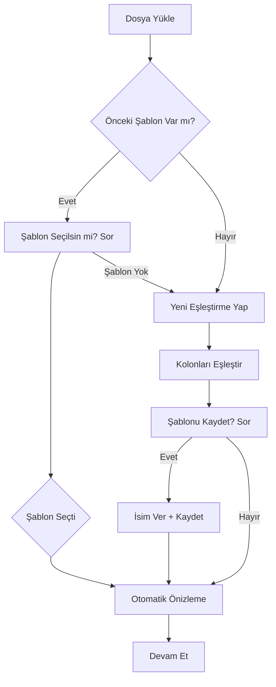

# Toplu Ürün Ekleme Modülü (Bulk Import)

## Genel Bakış

Bu doküman, Restaurant Management System (RMS) için geliştirilecek toplu ürün ekleme modülünün teknik tasarımını içerir.

## Mevcut Durum Analizi

### Backend Stack
- **Framework**: NestJS
- **Database**: PostgreSQL (TypeORM)
- **Queue**: RabbitMQ (amqp-connection-manager)
- **WebSocket**: Socket.io (@nestjs/websockets)
- **Excel Processing**: exceljs (yüklü)
- **File Upload**: Multer + Sharp

### Frontend Stack
- **Framework**: Next.js 14+ (App Router)
- **UI**: React + Tailwind CSS
- **API Client**: Axios wrapper
- **State**: React Query + Context

### Mevcut Menu Item Yapısı
```typescript
interface MenuItem {
  id: string;
  name: string;
  description?: string;
  price: number;
  image_url?: string;
  is_available: boolean;
  track_inventory: boolean;
  category_id: string;
  category?: Category;
  recipes?: Recipe[];
}
```

---

## Sistem Mimarisi

```mermaid
flowchart TD
    A[Kullanıcı Dosya Yükler] --> B{ Dosya Boyutu }
    B -->| Küçük (<1MB) | C[Sync İşleme]
    B -->| Büyük (>1MB) | D[Queue'ya Ekle]
    
    C --> E[Parse Excel/CSV/JSON]
    D --> F[RabbitMQ Consumer]
    F --> E
    
    E --> G[Validasyon]
    G --> H{ Hata Var mı? }
    H -->| Evet | I[Hataları Göster]
    H -->| Hayır | J[Önizleme Ekranı]
    
    J --> K{Kullanıcı Onayı?}
    K -->| İptal | L[İşlemi İptal Et]
    K -->| Onayla | M[Chunk Processing]
    
    M --> N[100'ler İşle]
    N --> O[WebSocket Progress]
    O --> P{ Bitmedi mi? }
    P -->| Evet | N
    P -->| Hayır | Q[Sonuç Özeti]
    
    I --> J
    Q --> R[İşlem Tamamlandı]
```

---

## Backend Modülü: `bulk-import`

### Klasör Yapısı

```
backend/src/modules/bulk-import/
├── bulk-import.module.ts
├── bulk-import.controller.ts
├── bulk-import.service.ts
├── bulk-import.consumer.ts          # RabbitMQ consumer
├── dto/
│   ├── upload-file.dto.ts
│   ├── preview-import.dto.ts
│   ├── confirm-import.dto.ts
│   └── import-progress.dto.ts
├── entities/
│   └── import-job.entity.ts         # Import job tracking
├── parsers/
│   ├── base.parser.ts
│   ├── excel.parser.ts
│   ├── csv.parser.ts
│   └── json.parser.ts
├── validators/
│   ├── import-validator.service.ts
│   └── field-mapper.service.ts
├── matchers/
│   └── product-matcher.service.ts  # Fuzzy matching
└── interfaces/
    ├── import-job.interface.ts
    └── parsed-row.interface.ts
```

### Ana Özellikler

#### 1. Dosya Upload Endpoint

```typescript
// POST /api/bulk-import/upload
// - Multipart file upload
// - Desteklenen formatlar: .xlsx, .xls, .csv, .json
// - Max dosya boyutu: 10MB
// - Küçük dosyalar için sync, büyük dosyalar için queue
```

#### 2. Parsers

| Format | Kütüphane | Açıklama |
|--------|-----------|-----------|
| Excel | exceljs | .xlsx, .xls dosyaları |
| CSV | csv-parser / native | UTF-8 CSV dosyaları |
| JSON | native | Array of objects |

#### 3. Önizleme Endpoint

```typescript
// GET /api/bulk-import/:jobId/preview
// İlk 10 kayıt döner
// Field mapping durumu
// Validation hataları
```

#### 4. Onay ve İşleme

```typescript
// POST /api/bulk-import/:jobId/confirm
// - chunkSize: 100 (her seferde 100 kayıt)
// - Her chunk tamamlandığında WebSocket ile bildirim
// - Transaction: Her chunk ayrı transaction
```

### Ürün Eşleştirme Mantığı (Fuzzy Matching)

```typescript
interface MatchResult {
  originalName: string;      // Excel'deki isim
  matchedItem?: MenuItem;    // Eşleşen ürün
  matchScore: number;        // 0-100 arası benzerlik skoru
  suggestions: MenuItem[];   // Önerilen ürünler
  action: 'CREATE_NEW' | 'UPDATE_EXISTING' | 'MANUAL_REVIEW';
}

// Matching algoritması:
// 1. Tam eşleşme (name === name)
// 2. Fuzzy matching (Levenshtein distance)
// 3. Kısmi eşleşme (name contains)
// 4. Öneri listesi (top 3 match)
```

### Validasyon Kuralları

```typescript
const validationRules = {
  name: { required: true, minLength: 2, maxLength: 100 },
  price: { required: true, type: 'number', min: 0 },
  category: { required: true },  // Kategori adı veya ID
  description: { maxLength: 500 },
  is_available: { type: 'boolean', default: true },
  track_inventory: { type: 'boolean', default: false },
};
```

---

## Frontend Modülü: `bulk-import`

### Klasör Yapısı

```
frontend/modules/bulk-import/
├── types.ts
├── service.ts
├── schemas.ts                # Zod validation
├── components/
│   ├── FileUploader.tsx      # Drag & drop
│   ├── ImportPreview.tsx     # Önizleme tablosu
│   ├── FieldMapper.tsx       # Kolon eşleştirme
│   ├── ValidationErrors.tsx  # Hata gösterimi
│   ├── ProgressBar.tsx       # Real-time progress
│   └── ImportResult.tsx      # Sonuç özeti
├── hooks/
│   └── useBulkImport.ts      # Ana hook
└── page.tsx                  # Ana sayfa
```

### Kullanıcı Akışı

```mermaid
flowchart TD
    A[Dosya Yükle] --> B{Format Uygun mu?}
    B -->|Hayır| C[Hata Mesajı]
    B -->|Evet| D[Önizleme Göster]
    
    D --> E{Kolon Eşleştirme}
    E --> F[Eksik Zorunlu Alan Var mı?]
    F -->|Evet| G[Kullanıcı Eşlesin]
    F -->|Hayır| H[Validasyon Sonuçları]
    
    H --> I[Hataları Göster]
    I --> J[Eşleştirme Seçenekleri]
    
    J --> K[Ürün Eşleştirme]
    K --> L{Yeni Ürün mü?]
    L -->|Evet| M[Yeni Oluştur]
    L -->|Hayır| N[Mevcut Güncelle]
    
    M --> O[İçe Aktarımı Başlat]
    N --> O
    
    O --> P[Progress Bar]
    P --> Q{Bitti mi?}
    Q -->|Hayır| P
    Q -->|Evet| R[Sonuç Özeti]
```

### Bileşen Detayları

#### FileUploader
- Drag & drop desteği
- Dosya format kontrolü (.xlsx, .xls, .csv, .json)
- Dosya boyutu gösterimi
- Progress indicator

#### ImportPreview
- Tablo halinde ilk 10 kayıt
- Sütun başlıkları editable
- Validasyon hataları kırmızı ile işaretli
- Satır bazında detay

#### FieldMapper
- Excel header'ları → MenuItem alanları
- Otomatik eşleştirme önerileri
- Manuel düzeltme imkanı

#### ProgressBar
- WebSocket ile real-time güncelleme
- Yüzde gösterimi
- İşlenen / Toplam kayıt
- Tahmini süre
- İptal butonu

---

## Queue Sistemi (RabbitMQ)

### Queue Yapısı

```typescript
// Queue name: bulk_import_queue
interface ImportJobMessage {
  jobId: string;
  restaurantId: string;
  userId: string;
  filePath: string;
  format: 'excel' | 'csv' | 'json';
  chunkSize: number;
  totalRows: number;
}

// Progress updates: bulk_import_progress_{jobId}
interface ProgressUpdate {
  jobId: string;
  currentChunk: number;
  totalChunks: number;
  processedRows: number;
  successCount: number;
  errorCount: number;
  errors: ChunkError[];
}
```

### Consumer İşlem Adımları

1. Dosyayı parse et
2. Her 100 kayıt için:
   - Validasyon yap
   - Ürün eşleştir (fuzzy)
   - Transaction ile kaydet
   - Progress emit et
3. Sonuçları kaydet
4. WebSocket ile bildirim gönder

---

## WebSocket Entegrasyonu

### Event'ler

```typescript
// Client → Server
'bulk_import:start'     // İçe aktarımı başlat
'bulk_import:cancel'    // İçe aktarımı iptal et
'bulk_import:progress'  // Progress talep et (poll)

// Server → Client
'bulk_import:progress'  // Real-time progress
'bulk_import:complete'   // İşlem tamamlandı
'bulk_import:error'     // Hata oluştu
```

---

## Veritabanı

### Import Job Tablosu

```sql
CREATE TABLE import_jobs (
  id UUID PRIMARY KEY DEFAULT gen_random_uuid(),
  restaurant_id UUID NOT NULL,
  user_id UUID NOT NULL,
  filename VARCHAR(255) NOT NULL,
  format VARCHAR(10) NOT NULL,
  total_rows INTEGER NOT NULL,
  processed_rows INTEGER DEFAULT 0,
  success_count INTEGER DEFAULT 0,
  error_count INTEGER DEFAULT 0,
  status VARCHAR(20) DEFAULT 'pending',
  -- pending, processing, completed, failed, cancelled
  errors JSONB,
  mapping_config JSONB,
  created_at TIMESTAMP DEFAULT NOW(),
  updated_at TIMESTAMP DEFAULT NOW(),
  completed_at TIMESTAMP
);

CREATE INDEX idx_import_jobs_restaurant ON import_jobs(restaurant_id);
CREATE INDEX idx_import_jobs_status ON import_jobs(status);
```

---

## API Endpoints

| Method | Endpoint | Açıklama |
|--------|----------|----------|
| POST | `/api/bulk-import/upload` | Dosya yükle ve parse et |
| GET | `/api/bulk-import/:jobId` | Job durumunu getir |
| GET | `/api/bulk-import/:jobId/preview` | Önizleme getir |
| POST | `/api/bulk-import/:jobId/confirm` | İçe aktarımı onayla |
| DELETE | `/api/bulk-import/:jobId` | Job'u iptal et/sil |

---

## Örnek Excel Formatı

| A | B | C | D | E | F |
|---|---|---|---|---|---|
| **Ürün Adı** | **Fiyat** | **Açıklama** | **Kategori** | **Stok Takip** | **Aktif** |
| Köfte Burger | 125.90 | Bol soslu köfte burger | Burger | TRUE | TRUE |
| Cola's | 25.00 | Soğuk kola | İçecek | FALSE | TRUE |

---

## Sonraki Adımlar

1. [ ] Plan onay alındıktan sonra backend modülü oluşturulacak
2. [ ] Frontend modülü ve bileşenleri geliştirilecek
3. [ ] Queue sistemi entegre edilecek
4. [ ] WebSocket progress bar bağlanacak
5. [ ] E2E testleri yazılacak

---

## Şablon Sistemi (Field Mapping Templates)

Kullanıcının dosyadaki kolonları sistem alanlarına eşleştirmesini kaydedip tekrar kullanılabilir hale getiren sistem.

### Kullanım Senaryosu

Örneğin:
- Excel'de "Ürün İsmi" kolonu → MenuItem.name
- Excel'de "Fiyat (TL)" kolonu → MenuItem.price
- Excel'de "Kategori Adı" kolonu → category_id (auto-resolve)

Bu eşleştirme bir "Şablon" olarak kaydedilir. Sonraki aynı formatlı dosyalarda şablon otomatik uygulanır.

### Veritabanı: Import Templates Tablosu

```sql
CREATE TABLE import_templates (
  id UUID PRIMARY KEY DEFAULT gen_random_uuid(),
  restaurant_id UUID NOT NULL,
  name VARCHAR(100) NOT NULL,           -- "Aylık Menu Güncelleme", "Yeni Sezon Ürünleri"
  description VARCHAR(255),
  
  -- Hangi dosya formatı için geçerli
  format VARCHAR(10) NOT NULL,           -- excel, csv, json
  
  -- Alan eşleştirmeleri (JSON)
  field_mappings JSONB NOT NULL,        
  -- Örnek: {
  --   "Ürün İsmi": "name",
  --   "Fiyat": "price",
  --   "Kategori": "category_id",
  --   "Açıklama": "description"
  -- }
  
  -- Otomatik eşleştirme kuralları
  auto_match_rules JSONB,
  -- Örnek: {
  --   "category": { "strategy": "resolve_by_name", "target": "category_id" },
  --   "track_inventory": { "strategy": "static", "value": false }
  -- }
  
  created_by UUID NOT NULL,
  created_at TIMESTAMP DEFAULT NOW(),
  updated_at TIMESTAMP DEFAULT NOW()
);

CREATE INDEX idx_import_templates_restaurant ON import_templates(restaurant_id);
```

### Template Yönetimi API

| Method | Endpoint | Açıklama |
|--------|----------|----------|
| GET | `/api/bulk-import/templates` | Restoranın şablonlarını listele |
| POST | `/api/bulk-import/templates` | Yeni şablon oluştur |
| GET | `/api/bulk-import/templates/:id` | Şablon detayını getir |
| PATCH | `/api/bulk-import/templates/:id` | Şablonu güncelle |
| DELETE | `/api/bulk-import/templates/:id` | Şablonu sil |

### Frontend: Şablon Seçimi Akışı



### Auto-Match Stratejileri

```typescript
type AutoMatchStrategy = 
  | { type: 'static'; value: any }                    // Sabit değer
  | { type: 'resolve_by_name'; target: string }        // İsme göre çözümle
  | { type: 'calculate'; formula: string }            // Hesaplama
  | { type: 'default'; value: any };                  // Varsayılan değer

// Örnek kullanım:
// {
//   "category_id": { 
//     type: "resolve_by_name", 
//     target: "category_id",
//     fallback: "create_new"  // Kategori yoksa oluştur
//   },
//   "track_inventory": { type: "static", value: false },
//   "is_available": { type: "default", value: true }
// }
```

### Şablon Oluşturma Akışı

1. Kullanıcı dosyayı yükler
2. Sistem otomatik kolon eşleştirmesi dener (örneğin "Fiyat" → "price")
3. Kullanıcı eşleştirmeleri düzeltir
4. İsteğe bağlı: "Bu eşleştirmeyi şablon olarak kaydet" butonu
5. Şablon adı girilir ve kaydedilir
6. Sonraki importlarda şablon otomatik uygulanabilir

### Dosya Yapısı Güncellemesi

```
backend/src/modules/bulk-import/
├── bulk-import.module.ts
├── bulk-import.controller.ts
├── bulk-import.service.ts
├── bulk-import.consumer.ts
├── dto/
│   ├── upload-file.dto.ts
│   ├── preview-import.dto.ts
│   ├── confirm-import.dto.ts
│   ├── import-progress.dto.ts
│   └── template.dto.ts              # YENİ
├── entities/
│   ├── import-job.entity.ts
│   └── import-template.entity.ts    # YENİ
├── parsers/
│   ├── base.parser.ts
│   ├── excel.parser.ts
│   ├── csv.parser.ts
│   └── json.parser.ts
├── validators/
│   ├── import-validator.service.ts
│   └── field-mapper.service.ts
├── matchers/
│   └── product-matcher.service.ts
└── interfaces/
    ├── import-job.interface.ts
    └── parsed-row.interface.ts
```

### Notlar

- ExcelJS zaten projede yüklü
- RabbitMQ için mevcut konfigürasyon kullanılacak
- WebSocket için mevcut NotificationsGateway genişletilecek
- Dosya storage için mevcut uploads klasörü kullanılacak
