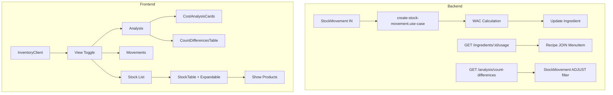

# Maliyet Analizi (Cost Analysis) - Güncellenmiş Uygulama Planı

## Genel Bakış

Bu plan, Envanter modülüne "Maliyet Analizi" görünümünün eklenmesini detaylandırmaktadır. Backend ve Frontend geliştirme kurallarına uygun olarak hazırlanmıştır.

---

## Mevcut Durum Analizi

### Backend (NestJS)

**Mevcut Entity'ler:**
- `Ingredient` - Malzeme (name, unit, restaurant_id, critical_level, average_cost, last_price)
- `Stock` - Stok durumu (quantity, ingredient_id)
- `StockMovement` - Stok hareketleri (type, quantity, reason, ingredient_id, unit_price)
- `Recipe` - Reçete (product_id, ingredient_id, quantity)
- `MenuItem` - Menü ürünü (name, price, track_inventory, category_id)

### Frontend (Next.js)

**Mevcut Bileşenler:**
- `InventoryClient.tsx` - Ana envanter sayfası (list/movements view toggle)
- `StockTable.tsx` - Malzeme tablosu (bulk edit mode desteği)
- `RecipeManager.tsx` - Reçete yönetimi

---

## Uygulama Adımları

### Phase 1: Backend - Domain Event & WAC

#### Step 1.1: Migration ve Entity Güncellemesi

```typescript
// Yeni kolonlar: previous_price, price_updated_at
// Migration dosyası oluştur
// Entity'ye alanları ekle
```

#### Step 1.2: DTO Oluşturma (Backend Rules'a uygun)

```typescript
// backend/src/modules/inventory/dto/get-cost-analysis.dto.ts
import { IsOptional, IsInt, Min } from 'class-validator';
import { Type } from 'class-transformer';
import { ApiPropertyOptional } from '@nestjs/swagger';

export class GetCostAnalysisDto {
  @ApiPropertyOptional({ default: 7 })
  @IsOptional()
  @Type(() => Number)
  @IsInt()
  @Min(1)
  days?: number = 7;
}

export class GetIngredientUsageDto {
  @ApiProperty({ description: 'Malzeme ID' })
  @IsString()
  @IsNotEmpty()
  ingredientId: string;
}
```

#### Step 1.3: Service Metodları (Backend Rules'a uygun)

```typescript
// InventoryService'de yeni metodlar:
// - calculateCostImpact(restaurantId: string)
// - getIngredientUsage(ingredientId: string, restaurantId: string)
// - getCountDifferences(restaurantId: string, weeks: number)
// - getFoodCostAlerts(restaurantId: string)
```

#### Step 1.4: Controller Endpoints

```
GET  /inventory/ingredients/cost-impact      - Maliyet etkisi özeti
GET  /inventory/ingredients/:id/usage          - Malzemenin kullanıldığı ürünler
GET  /inventory/analysis/count-differences     - Sayım farkları
GET  /inventory/analysis/food-cost-alerts      - Food Cost uyarıları
```

---

### Phase 2: Frontend - Types & Service

#### Step 2.1: TypeScript Tipleri (Frontend Rules'a uygun)

```typescript
// web/modules/inventory/types.ts
// Tüm yeni tipler ve yardımcı fonksiyonlar buraya

export interface IngredientUsage {
  ingredient: Ingredient;
  products: Array<{
    product_id: string;
    product_name: string;
    quantity: number;
    product_price: number;
  }>;
  total_products_affected: number;
}

export interface CostImpact {
  ingredient_id: string;
  ingredient_name: string;
  unit: string;
  previous_price: number;
  current_price: number;
  price_change: number;
  price_change_percent: number;
  monthly_consumption: number;
  cost_impact: number;
}

export interface CountDifference {
  date: string;
  ingredient_name: string;
  system_quantity: number;
  counted_quantity: number;
  difference: number;
  difference_try: number;
}

export interface FoodCostAlert {
  product_id: string;
  product_name: string;
  current_price: number;
  recipe_cost: number;
  food_cost_percent: number;
  suggested_price: number;
}

export interface CostAnalysisSummary {
  critical_stock_count: number;
  critical_stock_value: number;      // Toplam ₺ değeri
  price_increases: CostImpact[];
  total_monthly_loss: number;        // Aylık kayıp/kaçak
  recent_count_differences: CountDifference[];
  food_cost_alerts: FoodCostAlert[];
}
```

#### Step 2.2: Service Güncellemesi

```typescript
// web/modules/inventory/services/inventory.service.ts
export const inventoryApi = {
  // ... mevcut metodlar

  // Yeni analiz metodları
  getCostAnalysis: () => http.get<CostAnalysisSummary>('/inventory/ingredients/cost-impact'),
  getIngredientUsage: (id: string) => http.get<IngredientUsage>(`/inventory/ingredients/${id}/usage`),
  getCountDifferences: (weeks: number) => http.get<CountDifference[]>('/inventory/analysis/count-differences'),
  getFoodCostAlerts: () => http.get<FoodCostAlert[]>('/inventory/analysis/food-cost-alerts'),
}
```

---

### Phase 3: Frontend - Components

#### Step 3.1: StockTable - Expandable Rows (Max 200 satır kuralına uygun)

```typescript
// web/modules/inventory/components/StockTable.tsx
// Her satıra expand butonu ekle
// Tıklandığında malzemenin kullanıldığı ürünleri göster
// İçerik ~50 satır olmalı
```

**Props Interface:**
```typescript
interface StockTableProps {
  ingredients: Ingredient[];
  onAddMovement: (ingredient: Ingredient, type: MovementType) => void;
  onEdit: (ingredient: Ingredient) => void;
  onViewProductUsage?: (ingredientId: string) => void;  // Yeni
  isBulkEditMode?: boolean;
  onBulkSave?: (updates: BulkStockUpdate[]) => void;
  onToggleBulkMode?: (enabled: boolean) => void;
}
```

#### Step 3.2: InventoryClient - Analysis View (Max 200 satır)

```typescript
// web/modules/inventory/components/InventoryClient.tsx
// Üçüncü sekme: 'analysis'
// View toggle: 'list' | 'movements' | 'analysis'

// Analysis view içeriği ayrı component'lere böl:
// - CostAnalysisCards.tsx (KPI kartları)
// - CountDifferencesTable.tsx (Sayım farkları)
```

#### Step 3.3: CostAnalysisCards Component

```typescript
// web/modules/inventory/components/CostAnalysisCards.tsx
// Üç KPI kartı:
// 1. Kritik Stok Değeri (₺) - text-danger-main
// 2. Aylık Kayıp/Kaçak - text-warning-main  
// 3. Fiyat Artış Etkisi - text-info-main
```

#### Step 3.4: CountDifferencesTable Component

```typescript
// web/modules/inventory/components/CountDifferencesTable.tsx
// Haftalık sayım farkları tablosu
// Kolonlar: Tarih, Malzeme, Sistem, Sayılan, Fark(kg), Fark(₺)
```

---

### Phase 4: RecipeManager - Unit Conversion Helper

```typescript
// web/modules/shared/utils/unit-conversion.ts veya types.ts içinde
export function convertQuantity(
  value: number, 
  fromUnit: string, 
  toUnit: string
): number {
  // Gr -> Kg
  if (fromUnit === 'gr' && toUnit === 'kg') return value / 1000;
  // Kg -> Gr
  if (fromUnit === 'kg' && toUnit === 'gr') return value * 1000;
  // Lt -> Ml
  if (fromUnit === 'lt' && toUnit === 'ml') return value * 1000;
  // Ml -> Lt
  if (fromUnit === 'ml' && toUnit === 'lt') return value / 1000;
  
  return value;
}

// Food Cost hesaplama
export function calculateFoodCost(recipeCost: number, productPrice: number): number {
  if (productPrice === 0) return 0;
  return (recipeCost / productPrice) * 100;
}
```

---

## Dosya Yapısı

### Backend

```
backend/src/modules/inventory/
├── entities/
│   └── ingredient.entity.ts        # + previous_price, price_updated_at
├── dto/
│   └── get-cost-analysis.dto.ts   # YENİ - DTO'lar
├── use-cases/
│   └── create-stock-movement.use-case.ts  # + WAC calculation
├── inventory.service.ts           # + analiz metodları
└── inventory.controller.ts        # + analiz endpoints
```

### Frontend

```
web/modules/inventory/
├── components/
│   ├── InventoryClient.tsx         # + analysis view
│   ├── StockTable.tsx              # + expandable rows
│   ├── CostAnalysisCards.tsx       # YENİ - KPI kartları (~50 satır)
│   └── CountDifferencesTable.tsx  # YENİ - Sayım farkları (~80 satır)
├── services/
│   └── inventory.service.ts        # + analiz API metodları
└── types.ts                       # + yeni tipler + helper fonksiyonlar

web/modules/shared/utils/
└── unit-conversion.ts             # YENİ - Birim dönüşümü
```

---

## Kural Uyum Kontrolü

### Backend Rules Uyumu

| Kural | Uygulama |
|-------|----------|
| DTO ile veri kontrolü | Tüm input'lar için class-validator |
| Multi-tenant | restaurantId ile filtreleme |
| Query Builder | Karmaşık sorgularda |
| Naming Convention | camelCase/PascalCase |
| Standart Response | TransformInterceptor kullanımı |

### Frontend Rules Uyumu

| Kural | Uygulama |
|-------|----------|
| Max 200 satır/component | Component'leri böl |
| types.ts'de tipler | Tüm tipler tek dosyada |
| cn utility | className birleştirme |
| Semantic colors | bg-bg-app, text-danger-main |
| Server-Client ayrımı | page.tsx / _components/* |

---

## Mermaid Diagram



---

## Öncelik Sıralaması

| Öncelik | Özellik | Açıklama |
|---------|---------|-----------|
| 1 | Reçete Bağımlılığı | Expandable row + usage API |
| 2 | Maliyet Etkisi | Fiyat artışı takibi + KPI kartları |
| 3 | Food Cost Uyarısı | %35 eşik kontrolü |
| 4 | Sayım Farkı | Hızlı sayım raporu |

---

## Notlar

1. **WAC Hesaplama**: Sadece stock IN (giriş) hareketlerinde çalışmalı
2. **Food Cost %35**: Restaurant endüstrisi standardı
3. **Expandable Row**: Lazy loading kullanılmalı (performans)
4. **Semantic Colors**: `text-danger-main`, `bg-warning-main` gibi token'lar kullanılmalı
