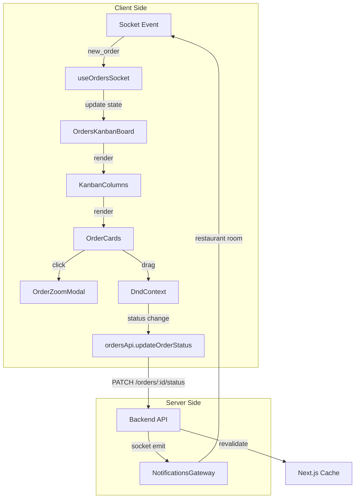
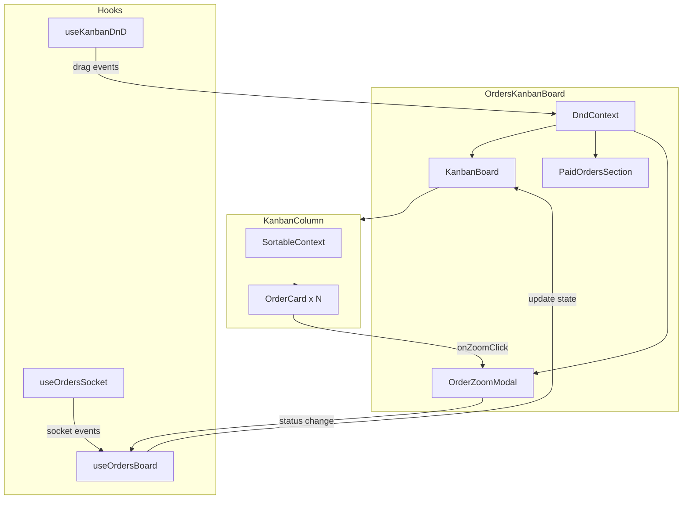

# Orders Kanban Board Refactor Implementation Plan

## Overview

Bu doküman, mevcut Orders Kanban Board'un redesign edilmesi için kapsamlı bir implementasyon planı sunmaktadır. Plan, drag-and-drop fonksiyonalitesi, sipariş içi farklı isteklerin vurgulanması, zoom modal, paid orders ayrımı ve socket entegrasyonunu içermektedir.

---

## 1. Mevcut Durum Analizi

### 1.1 Mevcut Bileşenler

```
web/modules/orders/
├── components/
│   ├── KanbanBoard.tsx        # Board container - sütunları barındırır
│   ├── KanbanColumn.tsx       # Tek status sütunu - SortableContext
│   ├── OrderCard.tsx          # Sipariş kartı - useSortable (draggable hazır)
│   ├── OrdersBoardClient.tsx   # Ana client component
│   ├── OrderDetailDrawer.tsx  # Sipariş detay çekmecesi
│   └── BoardFilters.tsx       # Filtreler
├── hooks/
│   ├── useOrdersBoard.ts      # Board state yönetimi
│   ├── useOrdersSocket.ts     # Socket bağlantısı
│   └── useOrdersLogic.ts      # Sipariş mantığı
├── types.ts                   # Tip tanımları
└── services.ts                # API servisleri
```

### 1.2 Mevcut Özellikler

- ✅ Kanban sütunları ile sipariş listeleme
- ✅ Siparişlerin masa/kullanıcı bazında gruplanması (OrderGroup)
- ✅ Sütunlarda SortableContext hazırlığı (draggable için altyapı var)
- ✅ Socket entegrasyonu (order_created, order_updated, order_status_changed)
- ✅ Sipariş detay drawer'ı

### 1.3 Eksik Olan Özellikler

- ❌ Drag-and-drop ile status değiştirme (altyapı hazır ama implementasyon yok)
- ❌ Aynı sipariş içindeki farklı isteklerin vurgulanması
- ❌ Kartları büyüten zoom modal
- ❌ Paid siparişlerin ayrı bölümde gösterilmesi

---

## 2. Hedef Mimari

### 2.1 Yeni Bileşen Yapısı

```
web/modules/orders/
├── components/
│   ├── kanban/                    # Kanban ile ilgili bileşenler
│   │   ├── OrdersKanbanBoard.tsx  # Ana board (DndContext ile sarmalanmış)
│   │   ├── KanbanColumn.tsx       # Sütun bileşeni (Droppable)
│   │   ├── OrderCard.tsx          # Sipariş kartı (Draggable)
│   │   ├── OrderCardExpanded.tsx  # Genişletilmiş kart görünümü
│   │   ├── PaidOrdersSection.tsx  # Ödenmiş siparişler bölümü
│   │   └── BoardFilters.tsx       # Filtreler
│   ├── modals/
│   │   ├── OrderZoomModal.tsx     # Sipariş detay modalı (büyütülmüş)
│   │   └── OrderItemsModal.tsx    # Sipariş kalemleri modalı
│   ├── OrdersBoardClient.tsx      # Ana client component (güncellenecek)
│   └── OrderDetailDrawer.tsx      # Mevcut drawer (korunacak)
├── hooks/
│   ├── useKanbanDnD.ts           # Drag-and-drop mantığı
│   ├── useOrdersSocket.ts        # Socket (güncellenecek)
│   └── useOrderGrouping.ts       # Sipariş gruplama mantığı
└── types.ts                      # Tipler (güncellenecek)
```

### 2.2 Veri Akışı Diyagramı



---

## 3. Detaylı Implementasyon Planı

### 3.1 Adım 1: Tip Tanımlarını Güncelleme

**Dosya:** `web/modules/orders/types.ts`

```typescript
// Yeni tipler eklenecek

/**
 * Sipariş içindeki farklı istek/komut
 */
export interface OrderRequest {
  id: string
  orderId: string
  note?: string           // Özel istek notu
  requestedAt: Date       // İsteğin yapıldığı zaman
  status: OrderStatus    // İsteğin durumu
  items: OrderItem[]     // İsteğe ait ürünler
}

/**
 * Genişletilmiş sipariş grubu
 */
export interface OrderGroup {
  // ... mevcut alanlar ...
  requests: OrderRequest[]  // Farklı istekler dizisi
  firstRequestTime: Date     // İlk istek zamanı
  lastRequestTime: Date      // Son istek zamanı
}
```

### 3.2 Adım 2: Drag-and-Drop Entegrasyonu

**Dosya:** `web/modules/orders/hooks/useKanbanDnD.ts`

```typescript
// Yeni hook oluşturulacak

import { useState, useCallback } from 'react'
import {
  DndContext,
  DragEndEvent,
  DragOverEvent,
  DragStartEvent,
  PointerSensor,
  TouchSensor,
  useSensor,
  useSensors,
} from '@dnd-kit/core'
import { OrderStatus, Order } from '../types'

interface UseKanbanDnDProps {
  onStatusChange: (orderId: string, newStatus: OrderStatus) => Promise<void>
}

export function useKanbanDnD({ onStatusChange }: UseKanbanDnDProps) {
  const [activeOrder, setActiveOrder] = useState<Order | null>(null)
  const [isDragging, setIsDragging] = useState(false)

  const sensors = useSensors(
    useSensor(PointerSensor, {
      activationConstraint: {
        distance: 8,
      },
    }),
    useSensor(TouchSensor, {
      activationConstraint: {
        delay: 200,
        tolerance: 8,
      },
    })
  )

  const handleDragStart = useCallback((event: DragStartEvent) => {
    const { active } = event
    setActiveOrder(active.data.current as Order)
    setIsDragging(true)
  }, [])

  const handleDragEnd = useCallback(async (event: DragEndEvent) => {
    const { active, over } = event
    
    if (!over) {
      setIsDragging(false)
      setActiveOrder(null)
      return
    }

    const activeOrderId = active.id as string
    const newStatus = over.id as OrderStatus

    // Status değişikliği API çağrısı
    await onStatusChange(activeOrderId, newStatus)
    
    setIsDragging(false)
    setActiveOrder(null)
  }, [onStatusChange])

  return {
    sensors,
    activeOrder,
    isDragging,
    handleDragStart,
    handleDragEnd,
  }
}
```

### 3.3 Adım 3: OrderCard'a Zoom Özelliği Ekleme

**Dosya:** `web/modules/orders/components/kanban/OrderCard.tsx`

```typescript
// Mevcut OrderCard'a eklenecekler

interface OrderCardProps {
  orderGroup: OrderGroup
  onClick: () => void
  onZoomClick: () => void  // Yeni prop - zoom için
  onStatusChange: (orderId: string, newStatus: OrderStatus) => void
  isCompact?: boolean
  isDragging?: boolean
}

// Kart içinde zoom butonu
<div className="absolute top-2 right-2">
  <button
    onClick={(e) => {
      e.stopPropagation()
      onZoomClick()
    }}
    className="p-1.5 rounded-md hover:bg-gray-100 text-gray-400 hover:text-gray-600 transition-colors"
    aria-label="Siparişi büyüt"
  >
    <Maximize2 className="w-4 h-4" />
  </button>
</div>

// Farklı istekleri vurgulama
{orderGroup.requests.length > 1 && (
  <div className="mt-2 pt-2 border-t border-dashed border-gray-200">
    <div className="flex items-center gap-1 text-xs text-primary-main font-medium">
      <Layers className="w-3 h-3" />
      {orderGroup.requests.length} farklı istek
    </div>
  </div>
)}
```

### 3.4 Adım 4: OrderZoomModal Oluşturma

**Dosya:** `web/modules/orders/components/modals/OrderZoomModal.tsx`

```typescript
// Modal standartlarına uygun yeni bileşen

import { Modal } from '@/modules/shared/components/Modal'
import { OrderGroup, OrderStatus, ORDER_STATUS_LABELS } from '../../types'
import { formatDistanceToNow } from 'date-fns'
import { tr } from 'date-fns/locale'

interface OrderZoomModalProps {
  isOpen: boolean
  onClose: () => void
  orderGroup: OrderGroup | null
  onStatusChange: (orderId: string, newStatus: OrderStatus) => void
}

export function OrderZoomModal({
  isOpen,
  onClose,
  orderGroup,
  onStatusChange,
}: OrderZoomModalProps) {
  if (!orderGroup) return null

  return (
    <Modal
      isOpen={isOpen}
      onClose={onClose}
      title={`Sipariş Detayı - ${orderGroup.tableName}`}
      maxWidth="max-w-2xl"
    >
      <div className="space-y-6">
        {/* Sipariş Özeti */}
        <div className="grid grid-cols-2 gap-4">
          <div className="p-4 bg-gray-50 rounded-md">
            <p className="text-xs text-gray-500">Toplam Tutar</p>
            <p className="text-xl font-bold text-gray-900">
              {orderGroup.totalAmount.toFixed(2)} TL
            </p>
          </div>
          <div className="p-4 bg-gray-50 rounded-md">
            <p className="text-xs text-gray-500">Toplam Ürün</p>
            <p className="text-xl font-bold text-gray-900">
              {orderGroup.totalItems} adet
            </p>
          </div>
        </div>

        {/* Farklı İstekler (Varsa) */}
        {orderGroup.requests.length > 1 && (
          <div className="space-y-3">
            <h3 className="text-sm font-semibold text-gray-900">
              Sipariş İstekleri ({orderGroup.requests.length})
            </h3>
            {orderGroup.requests.map((request, idx) => (
              <div
                key={request.id}
                className="p-3 border border-gray-200 rounded-md"
              >
                <div className="flex items-center justify-between mb-2">
                  <span className="text-sm font-medium">
                    İstek #{idx + 1}
                  </span>
                  <span className="text-xs text-gray-500">
                    {formatDistanceToNow(new Date(request.requestedAt), {
                      addSuffix: true,
                      locale: tr,
                    })}
                  </span>
                </div>
                
                {/* İstek kalemleri */}
                <div className="space-y-1">
                  {request.items.map((item) => (
                    <div
                      key={item.id}
                      className="flex justify-between text-sm"
                    >
                      <span>{item.quantity}x {item.menuItem?.name}</span>
                      {item.notes && (
                        <span className="text-xs text-gray-500 italic">
                          ({item.notes})
                        </span>
                      )}
                    </div>
                  ))}
                </div>
              </div>
            ))}
          </div>
        )}

        {/* Hızlı İşlemler */}
        <div className="flex gap-2 pt-4 border-t">
          <button className="flex-1 btn-primary">
            Ödemeye Git
          </button>
          <button className="flex-1 btn-secondary">
            Yazdır
          </button>
        </div>
      </div>
    </Modal>
  )
}
```

### 3.5 Adım 5: Paid Orders Section Oluşturma

**Dosya:** `web/modules/orders/components/kanban/PaidOrdersSection.tsx`

```typescript
interface PaidOrdersSectionProps {
  orders: OrderGroup[]
  onOrderClick: (orderGroup: OrderGroup) => void
  onZoomClick: (orderGroup: OrderGroup) => void
  isLoading?: boolean
}

export function PaidOrdersSection({
  orders,
  onOrderClick,
  onZoomClick,
  isLoading = false,
}: PaidOrdersSectionProps) {
  return (
    <div className="flex-shrink-0 border-t border-border-light bg-bg-muted/30">
      {/* Header */}
      <div className="flex items-center justify-between px-4 py-3 bg-success-subtle/20 border-b border-success-border/20">
        <div className="flex items-center gap-2">
          <CheckCircle className="w-4 h-4 text-success-main" />
          <span className="text-sm font-semibold text-success-text">
            Ödenen Siparişler
          </span>
        </div>
        <span className="text-xs px-2 py-0.5 rounded-full bg-success-bg text-success-text">
          {orders.length}
        </span>
      </div>

      {/* Orders Grid */}
      <div className="flex gap-3 p-4 overflow-x-auto">
        {isLoading ? (
          Array.from({ length: 3 }).map((_, i) => (
            <div
              key={i}
              className="w-48 h-24 bg-gray-100 animate-pulse rounded-md"
            />
          ))
        ) : orders.length === 0 ? (
          <div className="flex items-center justify-center h-20 text-gray-400 text-sm">
            Ödenen sipariş yok
          </div>
        ) : (
          orders.map((group) => (
            <div
              key={group.tableId}
              onClick={() => onOrderClick(group)}
              className="w-48 flex-shrink-0 bg-white rounded-md border border-success-border/30 p-3 cursor-pointer hover:shadow-md transition-shadow"
            >
              <div className="flex items-center justify-between">
                <span className="font-medium text-sm text-gray-900 truncate">
                  {group.tableName}
                </span>
                <button
                  onClick={(e) => {
                    e.stopPropagation()
                    onZoomClick(group)
                  }}
                  className="p-1 hover:bg-gray-100 rounded"
                >
                  <Maximize2 className="w-3 h-3 text-gray-400" />
                </button>
              </div>
              <div className="mt-2 flex items-center justify-between">
                <span className="text-xs text-gray-500">
                  {group.orders.length} sipariş
                </span>
                <span className="text-sm font-bold text-gray-900">
                  {group.totalAmount.toFixed(2)} TL
                </span>
              </div>
            </div>
          ))
        )}
      </div>
    </div>
  )
}
```

### 3.6 Adım 6: Socket Entegrasyonunu Güncelleme

**Dosya:** `web/modules/orders/hooks/useOrdersSocket.ts`

```typescript
// Güncellenecek socket hook

interface OrderSocketEvents {
  onOrderCreated?: (order: Order) => void
  onOrderUpdated?: (order: Order) => void
  onOrderStatusChanged?: (data: {
    orderId: string
    oldStatus: OrderStatus
    newStatus: OrderStatus
    order: Order
  }) => void
  onOrderItemAdded?: (data: {
    orderId: string
    item: OrderItem
    requestTime: Date
  }) => void  // Yeni event - siparişe yeni ürün eklendi
}

const SOCKET_EVENTS = {
  ORDER_CREATED: 'new_order',
  ORDER_UPDATED: 'order:updated',
  ORDER_STATUS_UPDATED: 'order_status_updated',
  ORDER_ITEM_ADDED: 'order_item_added',  // Yeni event
} as const
```

### 3.7 Adım 7: Ana Board Bileşenini Güncelleme

**Dosya:** `web/modules/orders/components/kanban/OrdersKanbanBoard.tsx`

```typescript
import { DndContext, DragOverlay } from '@dnd-kit/core'
import { useKanbanDnD } from '../../hooks/useKanbanDnD'
import { OrderZoomModal } from '../modals/OrderZoomModal'
import { PaidOrdersSection } from './PaidOrdersSection'

export function OrdersKanbanBoard({
  ordersByStatus,
  onStatusChange,
  onOrderClick,
  isLoading = false,
}: KanbanBoardProps) {
  const [zoomOrderGroup, setZoomOrderGroup] = useState<OrderGroup | null>(null)
  const [isZoomOpen, setIsZoomOpen] = useState(false)

  const {
    sensors,
    activeOrder,
    isDragging,
    handleDragStart,
    handleDragEnd,
  } = useKanbanDnD({ onStatusChange })

  // Paid orders'ları ayır
  const paidOrders = ordersByStatus[OrderStatus.PAID] || []
  const activeOrdersByStatus = { ...ordersByStatus }
  delete activeOrdersByStatus[OrderStatus.PAID]

  return (
    <DndContext
      sensors={sensors}
      onDragStart={handleDragStart}
      onDragEnd={handleDragEnd}
    >
      <div className="flex flex-col h-full">
        {/* Active Orders */}
        <div className="flex-1 overflow-x-auto overflow-y-hidden">
          <div className="flex gap-4 p-4 min-h-full">
            {ACTIVE_COLUMNS.map((column) => (
              <KanbanColumn
                key={column.status}
                status={column.status}
                label={column.label}
                color={column.color}
                icon={column.icon}
                orderGroups={getOrdersForStatus(column.status)}
                onStatusChange={onStatusChange}
                onOrderClick={onOrderClick}
                onZoomClick={(group) => {
                  setZoomOrderGroup(group)
                  setIsZoomOpen(true)
                }}
                isLoading={isLoading}
              />
            ))}
          </div>
        </div>

        {/* Paid Orders Section */}
        <PaidOrdersSection
          orders={paidOrders}
          onOrderClick={onOrderClick}
          onZoomClick={(group) => {
            setZoomOrderGroup(group)
            setIsZoomOpen(true)
          }}
          isLoading={isLoading}
        />
      </div>

      {/* Drag Overlay */}
      <DragOverlay>
        {activeOrder ? (
          <div className="bg-white rounded-lg shadow-xl border-2 border-primary-main opacity-90">
            {/* Dragging card preview */}
          </div>
        ) : null}
      </DragOverlay>

      {/* Zoom Modal */}
      <OrderZoomModal
        isOpen={isZoomOpen}
        onClose={() => {
          setIsZoomOpen(false)
          setZoomOrderGroup(null)
        }}
        orderGroup={zoomOrderGroup}
        onStatusChange={onStatusChange}
      />
    </DndContext>
  )
}
```

---

## 4. Backend Socket Event Güncellemeleri

### 4.1 Yeni Event: order_item_added

**Dosya:** `backend/src/modules/notifications/notifications.gateway.ts`

```typescript
// Siparişe yeni ürün eklendiğinde
notifyOrderItemAdded(restaurantId: string, data: {
  orderId: string
  item: OrderItem
  requestTime: Date
}) {
  this.server.to(restaurantId).emit('order_item_added', {
    orderId: data.orderId,
    item: data.item,
    requestTime: data.requestTime,
  })
}
```

---

## 5. Dosya Değişiklik Özeti

### 5.1 Yeni Oluşturulacak Dosyalar

| Dosya | Açıklama |
|--------|-----------|
| `web/modules/orders/hooks/useKanbanDnD.ts` | Drag-and-drop mantığı |
| `web/modules/orders/components/modals/OrderZoomModal.tsx` | Büyütülmüş sipariş modalı |
| `web/modules/orders/components/kanban/PaidOrdersSection.tsx` | Ödenen siparişler bölümü |
| `web/modules/orders/components/kanban/OrderCardExpanded.tsx` | Genişletilmiş kart bileşeni |

### 5.2 Güncellenecek Dosyalar

| Dosya | Değişiklik |
|--------|-----------|
| `web/modules/orders/types.ts` | OrderRequest, OrderGroup tipi güncelleme |
| `web/modules/orders/components/KanbanBoard.tsx` | DndContext entegrasyonu |
| `web/modules/orders/components/KanbanColumn.tsx` | Droppable yapma |
| `web/modules/orders/components/OrderCard.tsx` | Zoom butonu ve istek vurgulama |
| `web/modules/orders/components/OrdersBoardClient.tsx` | Yeni bileşenleri kullanma |
| `web/modules/orders/hooks/useOrdersSocket.ts` | Yeni socket eventleri |
| `backend/src/modules/notifications/notifications.gateway.ts` | Yeni emit fonksiyonları |

---

## 6. Design Tokens Uyumu

Tüm bileşenler RMS design token'larını kullanacak:

```typescript
// Kullanılacak token'lar
colors: {
  primary: {
    main: 'var(--primary-main)',    // Drag active için
    subtle: 'var(--primary-subtle)', // Vurgulama için
  },
  success: {
    main: 'var(--success-main)',    // Paid status
    bg: 'var(--success-bg)',
    border: 'var(--success-border)',
    text: 'var(--success-text)',
  },
  bg: {
    app: 'var(--bg-app)',
    surface: 'var(--bg-surface)',
    muted: 'var(--bg-muted)',
  },
  border: {
    light: 'var(--border-light)',
  },
}
```

---

## 7. Mermaid: Bileşen İlişkileri



---

## 8. Ek Özellikler (User Feedback)

### 8.1 Sesli Uyarılar (Sound Alerts)

**Dosya:** `web/modules/orders/hooks/useOrdersSocket.ts`

```typescript
// Yeni sesli uyarı fonksiyonu
effects.useEffect(() => {
  if (!handlers.onOrderCreated || !enableSound) return
  
  const playNotificationSound = () => {
    const audio = new Audio('/sounds/new-order.mp3')
    audio.volume = 0.5
    audio.play().catch(() => {}) // Ignore play errors
  }
  
  // Her yeni siparişte ses çal
  on(SOCKET_EVENTS.ORDER_CREATED, playNotificationSound)
  
  return () => off(SOCKET_EVENTS.ORDER_CREATED)
}, [handlers.onOrderCreated, enableSound])
```

### 8.2 Stale Order Görsel Belirteci

**Dosya:** `web/modules/orders/components/kanban/OrderCard.tsx`

```typescript
// Gecikmiş sipariş hesaplama
const getStaleIndicator = () => {
  const minutes = Math.floor(
    (Date.now() - new Date(orderGroup.lastRequestTime).getTime()) / (1000 * 60)
  )
  
  if (minutes >= 30) return 'stale-critical'   // 30+ dakika - kırmızı yanıp sönen
  if (minutes >= 15) return 'stale-warning'     // 15+ dakika - sarı
  return null                                   // Normal
}

const staleClass = getStaleIndicator()

// OrderCard render
<div 
  className={cn(
    'bg-white rounded-lg border',
    staleClass === 'stale-critical' && 'border-danger-main animate-pulse',
    staleClass === 'stale-warning' && 'border-warning-main'
  )}
>
  {/* ... */}
</div>
```

### 8.3 Optimistic Updates

**Dosya:** `web/modules/orders/hooks/useOrdersBoard.ts`

```typescript
// Optimistic status update
const updateStatus = useCallback(
  async (orderId: string, newStatus: OrderStatus) => {
    // 1. Önce local state'i güncelle (API beklemeden)
    const previousState = ordersByStatus
    
    setOrdersByStatus(prev => moveOrderToNewStatus(prev, orderId, newStatus))
    
    try {
      // 2. API çağrısı yap
      await ordersApi.updateOrderStatus(orderId, { status: newStatus })
      
      // 3. Cache invalidation
      revalidateTag(ORDERS_CACHE_TAGS.BOARD)
    } catch (error) {
      // 4. Hata olursa eski state'e geri dön
      setOrdersByStatus(previousState)
      console.error('Status update failed:', error)
      throw error
    }
  },
  [ordersByStatus]
)
```

### 8.4 Toplu Aksiyonlar (Bulk Actions)

**Dosya:** `web/modules/orders/components/kanban/KanbanColumn.tsx`

```typescript
interface KanbanColumnProps {
  // ... mevcut props
  onMarkAllReady?: () => void  // Yeni prop
  onMarkAllServed?: () => void // Yeni prop
}

// Column header'a ekle
<div className="flex items-center justify-between p-3">
  <div className="flex items-center gap-2">
    <IconComponent className={`w-4 h-4 ${colors.text}`} />
    <span className="font-semibold text-sm">{label}</span>
  </div>
  
  {/* Bulk actions dropdown */}
  {orderGroups.length > 0 && (
    <DropdownMenu>
      <DropdownMenuTrigger asChild>
        <button className="p-1 hover:bg-gray-100 rounded">
          <MoreHorizontal className="w-4 h-4" />
        </button>
      </DropdownMenuTrigger>
      <DropdownMenuContent>
        <DropdownMenuItem onClick={onMarkAllReady}>
          Tümünü Hazır İşaretle
        </DropdownMenuItem>
        <DropdownMenuItem onClick={onMarkAllServed}>
          Tümünü Servis Edildi Yap
        </DropdownMenuItem>
      </DropdownMenuContent>
    </DropdownMenu>
  )}
</div>
```

### 8.5 Arşiv Sistemi (Archive Toggle)

**Dosya:** `web/modules/orders/components/kanban/OrdersKanbanBoard.tsx`

```typescript
// Board state'ine eklenecek
const [showArchive, setShowArchive] = useState(false)

// Paid/Cancelled siparişleri ayrı tut
const archiveStatuses = [OrderStatus.PAID, OrderStatus.CANCELLED]
const activeOrdersByStatus = useMemo(() => {
  const filtered: OrdersByStatus = {}
  Object.entries(ordersByStatus).forEach(([status, groups]) => {
    if (!archiveStatuses.includes(status as OrderStatus)) {
      filtered[status as keyof OrdersByStatus] = groups
    }
  })
  return filtered
}, [ordersByStatus])

const archivedOrdersByStatus = useMemo(() => {
  const filtered: OrdersByStatus = {}
  Object.entries(ordersByStatus).forEach(([status, groups]) => {
    if (archiveStatuses.includes(status as OrderStatus)) {
      filtered[status as keyof OrdersByStatus] = groups
    }
  })
  return filtered
}, [ordersByStatus])

// Render
return (
  <div className="flex flex-col h-full">
    {/* Toggle Button */}
    <div className="flex justify-end px-4 py-2">
      <button
        onClick={() => setShowArchive(!showArchive)}
        className={cn(
          "flex items-center gap-2 px-3 py-1.5 rounded-md text-sm transition-colors",
          showArchive 
            ? "bg-primary-main text-white" 
            : "bg-gray-100 text-gray-600 hover:bg-gray-200"
        )}
      >
        <Archive className="w-4 h-4" />
        {showArchive ? 'Arşivi Gizle' : 'Arşivi Göster'}
      </button>
    </div>
    
    {/* Active Orders - Ana Board */}
    <div className="flex-1 overflow-x-auto overflow-y-hidden">
      {/* ... */}
    </div>
    
    {/* Archive Section - Koşullu Render */}
    {showArchive && (
      <PaidOrdersSection
        orders={archivedOrdersByStatus[OrderStatus.PAID] || []}
        onOrderClick={onOrderClick}
        onZoomClick={handleZoomClick}
      />
    )}
  </div>
)
```

> **Kullanıcı Geri Bildirimi**: Paid ve Cancelled siparişleri varsayılan olarak gizleyip "Arşiv" butonuyla açılması onaylandı. Bu, ana board'un kirletmemesini sağlar.

### 8.5 Socket Bağlantı Durumu

**Dosya:** `web/modules/orders/components/OrdersBoardClient.tsx`

```typescript
// Connection status indicator
const { isConnected } = useOrdersSocket(restaurantId, handlers)

return (
  <div className="flex flex-col h-full">
    {/* Connection status banner */}
    {!isConnected && (
      <div className="bg-warning-bg border-b border-warning-border px-4 py-2 flex items-center gap-2">
        <WifiOff className="w-4 h-4 text-warning-text" />
        <span className="text-sm text-warning-text">
          Bağlantı kesildi - Canlı veri akışı durdu
        </span>
        <button 
          onClick={() => connect(restaurantId)}
          className="ml-auto text-xs text-warning-text underline"
        >
          Yeniden bağlan
        </button>
      </div>
    )}
    
    {/* Rest of board */}
  </div>
)
```

---

## 9. Sonraki Adımlar

1. **Plan Onayı**: Kullanıcının planı onaylaması bekleniyor
2. **Tip Tanımları**: `types.ts` güncellenmesi
3. **Hook Geliştirme**: `useKanbanDnD` hook'unun yazılması
4. **Sesli Uyarılar**: Socket hook'una ses entegrasyonu
5. **Stale Indicator**: OrderCard'a zaman bazlı görsel indicator
6. **Optimistic Updates**: useOrdersBoard güncellemesi
7. **Bileşen Geliştirme**: Modal ve paid section bileşenleri
8. **Bulk Actions**: KanbanColumn'a toplu aksiyon butonları
9. **Connection Status**: Bağlantı durumu göstergesi
10. **Backend Socket**: Yeni event'lerin eklenmesi
11. **Test**: Drag-drop, socket ve modal testleri

---

*Bu plan, kullanıcı geri bildirimleri ile güncellenmiştir.*
