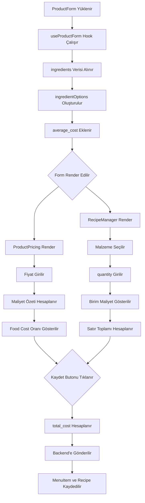

# Product Form & Recipe Manager - Maliyet Geliştirme Planı

## Genel Bakış

Bu doküman, ProductForm ve RecipeManager bileşenlerinin envanter maliyet verilerini gösterecek ve toplam ürün maliyetini hesaplayacak şekilde güncellenmesi için detaylı bir implementasyon planı sunmaktadır.

---

## Mevcut Durum Analizi

### İlgili Dosyalar

| Dosya | Mevcut Durum |
|--------|--------------|
| `web/modules/products/components/ProductForm.tsx` | Ana form bileşeni |
| `web/modules/products/components/RecipeManager.tsx` | Reçete yönetimi bileşeni |
| `web/modules/products/components/ProductPricing.tsx` | Fiyatlandırma bileşeni |
| `web/modules/products/types.ts` | Tip tanımları |
| `web/modules/inventory/types.ts` | Ingredient tip tanımı (average_cost mevcut) |
| `backend/src/modules/menus/dto/create-menu-item.dto.ts` | Backend DTO |

### Mevcut Veri Akışı

```
ProductForm
  ├── useProductForm hook (state yönetimi)
  │   ├── ingredients -> ingredientOptions (id, label, sublabel)
  │   ├── recipes -> RecipeItem[]
  │   └── formData -> { name, price, category_id, ... }
  │
  ├── ProductPricing (fiyat girişi)
  │
  └── RecipeManager (malzeme listesi)
      └── ingredientOptions -> SearchableSelect
```

---

## Gereksinimler ve Implementasyon Adımları

### 1. Veri Entegrasyonu (Data Integration)

**Hedef:** RecipeManager bileşenine gönderilen ingredientOptions veya arama sonuçları average_cost bilgisini içermeli.

#### 1.1 Ingredient Tip Güncellemesi

```typescript
// web/modules/inventory/types.ts - Mevcut zaten var
export interface Ingredient extends BaseEntity {
  name: string
  unit: string
  restaurant_id: string
  critical_level: number
  stock?: Stock
  average_cost?: number    // ✓ ZATEN VAR
  last_price?: number      // ✓ ZATEN VAR
}
```

#### 1.2 ingredientOptions Tip Güncellemesi

```typescript
// RecipeManager.tsx - Güncellenecek tip
interface RecipeManagerProps {
  // ... mevcut props
  ingredientOptions: Array<{
    id: string;
    label: string;
    sublabel?: string;
    average_cost?: number;  // YENİ - eklenecek
  }>;
  searchIngredients: (query: string) => Promise<Array<{
    id: string;
    label: string;
    sublabel?: string;
    average_cost?: number;  // YENİ - eklenecek
  }>>;
}
```

#### 1.3 useProductForm Hook Güncellemesi

```typescript
// ProductForm.tsx - ingredientOptions güncellemesi
const ingredientOptions = React.useMemo(() => {
  const baseOptions = ingredients.map(ing => ({
    id: ing.id,
    label: ing.name,
    sublabel: ing.unit,
    average_cost: ing.average_cost  // YENİ - eklenecek
  }))
  
  const newOptions = newIngredients.map(ing => ({
    id: ing.id,
    label: ing.name,
    sublabel: ing.unit,
    average_cost: ing.average_cost  // YENİ - eklenecek
  }))
  
  // ... mevcut mantık
  return [...baseOptions, ...newOptions]
}, [ingredients, newIngredients])
```

#### 1.4 searchIngredients Fonksiyonu Güncellemesi

```typescript
// ProductForm.tsx - searchIngredients güncellemesi
const searchIngredients = useCallback(async (query: string) => {
  if (!query || query.trim().length === 0) return []
  
  try {
    const response = await inventoryApi.getIngredients({ 
      name: query, 
      page: 1, 
      limit: 50 
    })
    
    const items = (response as any).data?.items || response.items || []
    return items.map((ing: Ingredient) => ({
      id: ing.id,
      label: ing.name,
      sublabel: ing.unit,
      average_cost: ing.average_cost  // YENİ - eklenecek
    }))
  } catch (error) {
    console.error('Ingredient search error:', error)
    return []
  }
}, [])
```

---

### 2. UI Güncellemeleri (RecipeManager.tsx)

**Hedef:** Reçete tablosuna "Birim Maliyet" ve "Satır Toplamı" sütunları ekle.

#### 2.1 Mevcut Yapı (Değişecek)

```typescript
// Mevcut satır yapısı
<div className="flex items-center gap-3 bg-bg-app py-3 px-2 border border-border-light rounded-sm ...">
  {/* Ingredient Select */}
  <div className="flex-1">
    <SearchableSelect ... />
  </div>
  
  {/* Quantity Input */}
  <div className="w-24">
    <FormInput ... />
  </div>
  
  {/* Action Buttons */}
  <div className="flex gap-1 ...">...</div>
</div>
```

#### 2.2 Yeni Yapı (Eklenecek)

```typescript
// Yeni satır yapısı
<div className="flex items-center gap-3 bg-bg-app py-3 px-2 border border-border-light rounded-sm ...">
  {/* Ingredient Select */}
  <div className="flex-1 min-w-[200px]">
    <SearchableSelect ... />
  </div>
  
  {/* Quantity Input */}
  <div className="w-24">
    <FormInput ... />
  </div>
  
  {/* YENİ: Birim Maliyet */}
  <div className="w-28 text-right">
    <span className="text-xs font-semibold text-text-secondary">
      {formatCurrency(getIngredientCost(recipe.ingredient_id))}
    </span>
    <span className="text-[9px] text-text-muted block">
      /{getIngredientUnit(recipe.ingredient_id)}
    </span>
  </div>
  
  {/* YENİ: Satır Toplamı */}
  <div className="w-28 text-right">
    <span className="text-xs font-bold text-text-primary">
      {formatCurrency(calculateLineTotal(recipe))}
    </span>
  </div>
  
  {/* Action Buttons */}
  <div className="flex gap-1 ...">...</div>
</div>
```

#### 2.3 Yardımcı Fonksiyonlar

```typescript
// RecipeManager.tsx içinde eklenecek
const getIngredientCost = (ingredientId?: string): number => {
  if (!ingredientId) return 0
  const option = ingredientOptions.find(o => o.id === ingredientId)
  return option?.average_cost || 0
}

const getIngredientUnit = (ingredientId?: string): string => {
  if (!ingredientId) return ''
  const option = ingredientOptions.find(o => o.id === ingredientId)
  return option?.sublabel || ''
}

const calculateLineTotal = (recipe: Partial<RecipeItem>): number => {
  const cost = getIngredientCost(recipe.ingredient_id)
  const quantity = Number(recipe.quantity) || 0
  return cost * quantity
}
```

---

### 3. Maliyet Özeti Bloğu

**Hedef:** Reçete listesinin altına maliyet özeti ekle.

#### 3.1 ProductPricing.tsx Güncellemesi

```typescript
// ProductPricingProps güncellemesi
interface ProductPricingProps {
  formData: {
    // ... mevcut alanlar
  };
  setFormData: React.Dispatch<...>;
  
  // YENİ: Maliyet bilgileri
  recipes?: Array<{
    ingredient_id?: string;
    quantity?: number;
  }>;
  ingredientOptions?: Array<{
    id: string;
    average_cost?: number;
  }>;
}
```

#### 3.2 Maliyet Özeti Bileşeni

```tsx
// ProductPricing.tsx içinde eklenecek
const CostSummary = ({ recipes, ingredientOptions, price }: CostSummaryProps) => {
  // Toplam reçete maliyeti hesapla
  const totalRecipeCost = recipes?.reduce((sum, recipe) => {
    const option = ingredientOptions?.find(o => o.id === recipe.ingredient_id)
    const cost = option?.average_cost || 0
    const quantity = Number(recipe.quantity) || 0
    return sum + (cost * quantity)
  }, 0) || 0

  // Satış fiyatı
  const sellingPrice = Number(price) || 0
  
  // Food Cost Oranı
  const foodCostRatio = sellingPrice > 0 ? (totalRecipeCost / sellingPrice) * 100 : 0
  
  // Brüt kâr
  const grossProfit = sellingPrice - totalRecipeCost
  
  // Uyarı durumları
  const isHighCost = foodCostRatio > 35
  const isLoss = sellingPrice < totalRecipeCost

  return (
    <div className="mt-6 pt-4 border-t border-border-light space-y-3">
      {/* Toplam Reçete Maliyeti */}
      <div className="flex justify-between items-center">
        <span className="text-[10px] font-semibold text-text-secondary uppercase tracking-wider">
          Toplam Reçete Maliyeti
        </span>
        <span className="text-sm font-bold text-text-primary">
          {formatCurrency(totalRecipeCost)}
        </span>
      </div>
      
      {/* Food Cost Oranı */}
      <div className="flex justify-between items-center">
        <span className="text-[10px] font-semibold text-text-secondary uppercase tracking-wider">
          Food Cost Oranı
        </span>
        <div className="flex items-center gap-2">
          {isHighCost && (
            <AlertTriangle size={14} className="text-danger-main" />
          )}
          <span className={`text-sm font-bold ${isHighCost ? 'text-danger-main' : 'text-text-primary'}`}>
            %{foodCostRatio.toFixed(1)}
          </span>
        </div>
      </div>
      
      {/* Brüt Kâr */}
      <div className="flex justify-between items-center">
        <span className="text-[10px] font-semibold text-text-secondary uppercase tracking-wider">
          Brüt Kâr
        </span>
        <span className={`text-sm font-bold ${isLoss ? 'text-danger-main' : 'text-success-main'}`}>
          {formatCurrency(grossProfit)}
        </span>
      </div>
      
      {/* Uyarılar */}
      {isLoss && (
        <div className="flex items-center gap-2 p-2 bg-danger-subtle border border-danger-main/20 rounded-sm">
          <AlertTriangle size={16} className="text-danger-main" />
          <span className="text-xs font-bold text-danger-main uppercase tracking-wider">
            Zararına Satış!
          </span>
        </div>
      )}
      
      {isHighCost && !isLoss && (
        <div className="flex items-center gap-2 p-2 bg-warning-subtle border border-warning-main/20 rounded-sm">
          <AlertTriangle size={16} className="text-warning-main" />
          <span className="text-xs font-bold text-warning-main uppercase tracking-wider">
            Yüksek Maliyet! (%35 üzeri)
          </span>
        </div>
      )}
    </div>
  )
}
```

---

### 4. Form Submit Mantığı

**Hedef:** Ürün kaydedilirken total_cost bilgisini backend'e gönder.

#### 4.1 Backend DTO Güncellemesi

```typescript
// backend/src/modules/menus/dto/create-menu-item.dto.ts
export class CreateMenuItemDto {
  // ... mevcut alanlar
  
  // YENİ: Toplam maliyet (opsiyonel)
  @ApiPropertyOptional({ example: 45.50 })
  @IsNumber()
  @IsOptional()
  @Min(0)
  @Type(() => Number)
  total_cost?: number;
}
```

#### 4.2 Frontend Form Submit Güncellemesi

```typescript
// ProductForm.tsx - handleFormSubmit
const handleFormSubmit = useCallback(async (e: React.FormEvent) => {
  e.preventDefault()
  
  // Toplam reçete maliyetini hesapla
  const totalRecipeCost = recipes.reduce((sum, recipe) => {
    const option = ingredientOptions.find(o => o.id === recipe.ingredient_id)
    const cost = option?.average_cost || 0
    const quantity = Number(recipe.quantity) || 0
    return sum + (cost * quantity)
  }, 0)
  
  await onSubmit({
    ...formData,
    price: Number(formData.price) || 0,
    total_cost: totalRecipeCost,  // YENİ - eklenecek
    recipes: recipes
      .filter(r => r.ingredient_id && Number(r.quantity) > 0)
      .map(r => ({
        ingredient_id: r.ingredient_id!,
        quantity: Number(r.quantity)
      })) as any
  }, selectedFile || undefined)
}, [formData, recipes, ingredientOptions, selectedFile, onSubmit])
```

---

### 5. ProductForm - Component Prop Geçişi

```typescript
// ProductForm.tsx - RecipeManager'a prop geçişi güncellemesi
<RecipeManager
  recipes={hook.recipes}
  setRecipes={hook.setRecipes}
  track_inventory={hook.formData.track_inventory}
  ingredientOptions={hook.ingredientOptions}
  searchIngredients={hook.searchIngredients}
  addRecipeItem={hook.addRecipeItem}
  removeRecipeItem={hook.removeRecipeItem}
  updateRecipeItem={hook.updateRecipeItem}
  restaurantId={restaurantId}
  initialData={initialData}
/>

// ProductPricing - maliyet bilgileri için prop geçişi
<ProductPricing
  formData={hook.formData}
  setFormData={hook.setFormData}
  recipes={hook.recipes}                    // YENİ
  ingredientOptions={hook.ingredientOptions} // YENİ
/>
```

---

## Değişiklik Özeti

| Dosya | Değişiklik Türü | Açıklama |
|--------|-----------------|-----------|
| `backend/src/modules/menus/dto/create-menu-item.dto.ts` | DTO güncelleme | `total_cost` alanı eklenecek |
| `web/modules/products/components/RecipeManager.tsx` | UI güncelleme | Birim maliyet ve satır toplamı sütunları |
| `web/modules/products/components/ProductPricing.tsx` | UI güncelleme | Maliyet özeti bloğu |
| `web/modules/products/components/ProductForm.tsx` | Prop geçişi | RecipeManager ve ProductPricing için yeni props |

---

## Mermaid Akış Diyagramı



---

## Test Senaryoları

### Başarılı Durumlar

1. ✅ Malzeme seçildiğinde birim maliyet görüntülenir
2. ✅ Miktar girildiğinde satır toplamı hesaplanır
3. ✅ Toplam reçete maliyeti doğru hesaplanır
4. ✅ Food cost oranı doğru hesaplanır
5. ✅ Brüt kâr doğru hesaplanır
6. ✅ Form submit edildiğinde total_cost gönderilir

### Uyarı Durumları

1. ✅ Food cost > %35 ise kırmızı uyarı gösterilir
2. ✅ Satış fiyatı < maliyet ise "ZARARINA SATIŞ" uyarısı gösterilir

### Edge Cases

1. ❌ average_cost yoksa 0 gösterilir
2. ❌ ingredient_id boşsa maliyet hesaplanmaz
3. ❌ quantity 0 ise satır toplamı 0 olur

---

## Sonraki Adımlar

1. Backend DTO'ya `total_cost` alanı ekle
2. Frontend'de ingredientOptions tipini güncelle
3. RecipeManager'a maliyet sütunları ekle
4. ProductPricing'a maliyet özeti ekle
5. useProductForm hook'unu güncelle
6. Prop geçişlerini düzelt
7. Test et ve doğrula
