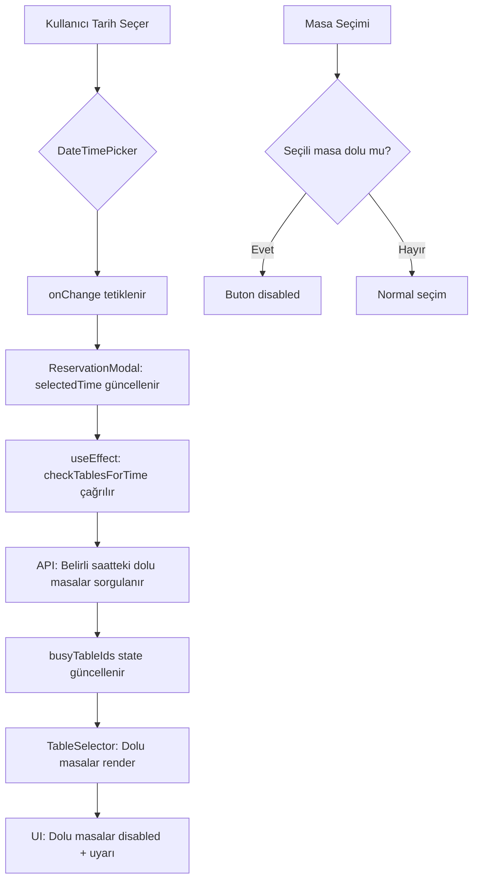

# Reservations Module Improvement Plan (v2)

## Overview

This plan addresses four key improvements for the reservations module:

1. **Customer Select Box** - Fix styling issues and improve dropdown usability
2. **New Customer Button** - Implement modal-based customer creation flow
3. **DateTime Picker** - Create a reusable Turkish date-time picker component
4. **Table Selection** - Improve design with better spacing and corporate look

---

## Issue Analysis

### Current Implementation Issues

**1. Customer Select Box (Line 354-385 in ReservationModal.tsx)**
- Problem: Search dropdown has `bg-bg-card` which may blend with background
- Problem: No visual distinction between available/selected states
- Problem: "New Customer" button creates inline form instead of modal

**2. Date/Time Input (Line 442-451 in ReservationModal.tsx)**
- Problem: Uses simple text input with manual format entry
- Problem: No date picker calendar
- Problem: No time picker - user must type format manually

**3. Table Selection (Line 474-511 in ReservationModal.tsx)**
- Problem: Compact buttons (h-[180px] height) with poor spacing
- Problem: Uses Button component which is designed for actions, not selection cards
- Problem: No visual grouping by area

---

## Solution Architecture

### 1. Customer Select Box Improvements

**Approach**: Refactor to use the existing `CustomerSelector` component from Orders module with a separate modal for new customer creation.

**Reference**: The Orders module already has a well-implemented `CustomerSelector.tsx` that:
- Has proper dropdown styling with `bg-bg-surface`
- Shows customer debt information
- Supports `onOpenNewCustomerModal` callback

**Files to Modify**:
- `web/modules/reservations/components/ReservationModal.tsx`

**Changes**:
1. Import and use existing `CustomerSelector` component
2. Import and use existing `NewCustomerModal` component
3. Add state for managing new customer modal visibility
4. Connect the customer selection to the form

### 2. New Customer Modal Integration

**Approach**: Use the existing `NewCustomerModal` component from Orders module, which provides a proper modal form for customer creation.

**Files to Modify**:
- `web/modules/reservations/components/ReservationModal.tsx`

**Changes**:
1. Add `NewCustomerModal` component to ReservationModal
2. Pass `onSuccess` callback to auto-select newly created customer
3. Remove inline customer form code (lines 387-437)

### 3. DateTimePicker Component (with Shortcuts)

**Approach**: Create a new reusable `DateTimePicker` component in shared components with quick date buttons.

**New File**:
- `web/modules/shared/components/DateTimePicker.tsx`

**Component Features**:
- Single input field with Turkish date format (GG.AA.YYYY SS:DD)
- Click to open date picker popup
- **Quick Date Buttons**:
  - "Bugün" (Today)
  - "Yarın" (Tomorrow)
  - "Hafta Sonu" (Weekend - Saturday/Sunday)
- Separate time selection
- Support show/hide time portion via prop
- Keyboard navigation support
- Turkish localization
- **react-hook-form Controller integration**

**Interface**:
```typescript
interface DateTimePickerProps {
  id: string;
  label: string;
  value: string; // ISO format: YYYY-MM-DDTHH:MM
  onChange: (value: string) => void;
  showTime?: boolean; // Default: true
  minDate?: Date;
  maxDate?: Date;
  error?: string;
  required?: boolean;
  disabled?: boolean;
}
```

**Quick Date Buttons Design**:
```tsx
<div className="flex gap-2 mb-3">
  <button type="button" onClick={() => setToToday()} className="px-3 py-1 text-xs bg-primary-main/10 text-primary-main rounded hover:bg-primary-main/20">
    Bugün
  </button>
  <button type="button" onClick={() => setToTomorrow()} className="px-3 py-1 text-xs bg-primary-main/10 text-primary-main rounded hover:bg-primary-main/20">
    Yarın
  </button>
  <button type="button" onClick={() => setToWeekend()} className="px-3 py-1 text-xs bg-primary-main/10 text-primary-main rounded hover:bg-primary-main/20">
    Hafta Sonu
  </button>
</div>
```

### 4. Table Selection Redesign (with Conflict Visualization)

**Approach**: Create a professional table grid selector with area grouping and conflict visualization.

**Files to Modify/Create**:
- `web/modules/reservations/components/TableSelector.tsx` (NEW)
- `web/modules/reservations/components/ReservationModal.tsx`

**New Component Features**:
- Grid layout with proper spacing (gap-3 or gap-4)
- Group tables by area
- **Conflict/Busy Visualization**:
  - `busyTableIds: string[]` prop
  - Tables that are busy at selected time show warning icon
  - Disabled state with "Bu saatte dolu" tooltip
- Visual table cards with:
  - Table name (prominent)
  - Capacity (subtitle)
  - Status indicator (colored badge)
  - Selection state (border highlight)
- Better hover states
- Scrollable container with max-height
- Empty state handling

**Interface**:
```typescript
interface TableSelectorProps {
  tables: Table[];
  selectedTableId?: string;
  onSelect: (tableId: string) => void;
  busyTableIds?: string[]; // Tables that are busy at selected time
  error?: string;
  disabled?: boolean;
}
```

**Conflict Visualization Design**:
```tsx
const isBusy = busyTableIds?.includes(table.id);

<TableCard className={isBusy ? 'opacity-60 cursor-not-allowed' : ''}>
  {isBusy && (
    <div className="absolute top-2 right-2">
      <AlertCircle className="h-4 w-4 text-warning-main" />
    </div>
  )}
  {isBusy && (
    <span className="text-xs text-warning-main">Bu saatte dolu</span>
  )}
</TableCard>
```

---

## Implementation Steps

### Step 1: Create DateTimePicker Component

**File**: `web/modules/shared/components/DateTimePicker.tsx`

```
[ ] Create DateTimePicker component
[ ] Implement date picker popup
[ ] Implement time picker
[ ] Add quick date buttons (Bugün, Yarın, Hafta Sonu)
[ ] Add Turkish localization
[ ] Add showTime prop support
[ ] Add Controller integration (for react-hook-form)
[ ] Test component
```

### Step 2: Create TableSelector Component

**File**: `web/modules/reservations/components/TableSelector.tsx`

```
[ ] Create TableSelector component
[ ] Add area grouping logic
[ ] Implement table card design
[ ] Add conflict/busy table visualization
[ ] Add selection states
[ ] Add disabled state for busy tables
[ ] Add tooltips for busy tables
[ ] Test component
```

### Step 3: Refactor ReservationModal

**File**: `web/modules/reservations/components/ReservationModal.tsx`

```
[ ] Replace customer search with CustomerSelector
[ ] Add NewCustomerModal integration
[ ] Replace date/time inputs with DateTimePicker
[ ] Replace table buttons with TableSelector
[ ] Add conflict checking: pass busyTableIds to TableSelector
[ ] Add Controller (react-hook-form) wrapper for new components
[ ] Test all functionality
```

### Step 4: Export Components

Update index files if needed for reusability.

---

## Detailed File Changes

### New File: `web/modules/shared/components/DateTimePicker.tsx`

**Purpose**: Reusable date-time picker with Turkish localization and quick buttons

**Key Features**:
- Single input showing formatted Turkish date-time
- Calendar popup for date selection
- **Quick Date Buttons**: Bugün, Yarın, Hafta Sonu
- Time picker with hour/minute selection
- `showTime` prop to toggle time portion
- Keyboard navigation support
- **react-hook-form compatible with Controller**
- Integration with react-hook-form compatible

**Dependencies**:
- Uses existing design tokens (bg, border, text colors)
- Uses lucide-react icons (Calendar, Clock)

---

### New File: `web/modules/reservations/components/TableSelector.tsx`

**Purpose**: Professional table selection grid with conflict visualization

**Props Interface**:
```typescript
interface TableSelectorProps {
  tables: Table[];
  selectedTableId?: string;
  onSelect: (tableId: string) => void;
  busyTableIds?: string[]; // Tables that are busy at selected time
  error?: string;
  disabled?: boolean;
}
```

**Design**:
- Grid layout (grid-cols-2 md:grid-cols-3 lg:grid-cols-4)
- Each table is a card with:
  - Left: Status dot + Table name + Capacity
  - Right: Checkmark when selected
  - **Busy indicator**: Warning icon + "Bu saatte dolu" text
- Area headers for grouping (optional)
- Smooth transitions on hover/select
- Disabled state for busy tables

---

### Modified: `web/modules/reservations/components/ReservationModal.tsx`

**Changes Summary**:

1. **Add Imports**:
   ```typescript
   import { CustomerSelector } from '@/modules/orders/components/CustomerSelector'
   import { NewCustomerModal } from '@/modules/orders/components/NewCustomerModal'
   import { DateTimePicker } from '@/modules/shared/components/DateTimePicker'
   import { TableSelector } from './TableSelector'
   import { Customer } from '@/modules/customers/services/customers.service'
   import { Controller } from 'react-hook-form'
   ```

2. **Add State**:
   ```typescript
   const [selectedCustomer, setSelectedCustomer] = useState<Customer | null>(null)
   const [showNewCustomerModal, setShowNewCustomerModal] = useState(false)
   const [busyTableIds, setBusyTableIds] = useState<string[]>([])
   ```

3. **Update Conflict Logic**:
   ```typescript
   // When time changes, update busy tables
   useEffect(() => {
     if (selectedTime && restaurantId) {
       // Fetch busy tables for selected time
       checkTablesForTime(selectedTime).then(busyIds => {
         setBusyTableIds(busyIds)
       })
     }
   }, [selectedTime, restaurantId])
   ```

4. **Replace Customer Section** (lines 336-438):
   - Remove inline search and form
   - Add CustomerSelector with modal support

5. **Replace Date/Time with Controller**:
   ```tsx
   <Controller
     name="reservation_time"
     control={control}
     render={({ field }) => (
       <DateTimePicker
         id="reservation_time"
         label="Tarih ve Saat"
         value={field.value}
         onChange={field.onChange}
         error={errors.reservation_time?.message}
         required
       />
     )}
   />
   ```

6. **Replace Table Selection with Controller and busyTableIds**:
   ```tsx
   <Controller
     name="table_id"
     control={control}
     render={({ field }) => (
       <TableSelector
         tables={tables}
         selectedTableId={field.value}
         onSelect={field.onChange}
         busyTableIds={busyTableIds}
         error={errors.table_id?.message}
       />
     )}
   />
   ```

---

## Data Flow: Conflict Detection



---

## Testing Checklist

### Customer Select Box
- [ ] Search dropdown displays correctly with proper background
- [ ] Search results are visible and selectable
- [ ] "New Customer" button opens modal
- [ ] New customer is auto-selected after creation
- [ ] Clear/reset functionality works
- [ ] Last reservation info is shown (if available from API)

### Date/Time Picker
- [ ] Date picker opens on click
- [ ] Date selection works with calendar
- [ ] Time selection works with picker
- [ ] Quick date buttons work:
  - [ ] "Bugün" sets today
  - [ ] "Yarın" sets tomorrow
  - [ ] "Hafta Sonu" sets next Saturday
- [ ] Value is formatted correctly in Turkish
- [ ] showTime prop toggles time visibility
- [ ] Works with react-hook-form Controller

### Table Selection
- [ ] Tables display in organized grid
- [ ] Tables are grouped by area (if areas exist)
- [ ] Selected table has visual highlight
- [ ] Table status (available/occupied) is visible
- [ ] **Busy tables show warning indicator**
- [ ] **Busy tables are disabled**
- [ ] **"Bu saatte dolu" tooltip is shown**
- [ ] Capacity information is displayed
- [ ] Hover states work correctly

---

## Files Reference

### Existing Components to Reuse
- `web/modules/orders/components/CustomerSelector.tsx` - Customer search dropdown
- `web/modules/orders/components/NewCustomerModal.tsx` - Customer creation modal
- `web/modules/shared/components/Modal.tsx` - Modal wrapper
- `web/modules/shared/components/FormInput.tsx` - Form input
- `web/modules/shared/components/FormSection.tsx` - Section wrapper
- `web/modules/shared/components/Button.tsx` - Button component
- `web/modules/tables/types.ts` - Table types and TableStatus enum

### Services Used
- `web/modules/customers/services/customers.service.ts` - Customer API
- `web/modules/tables/services/tables.service.ts` - Tables API

### New Components to Create
1. `web/modules/shared/components/DateTimePicker.tsx` - Date/time picker
2. `web/modules/reservations/components/TableSelector.tsx` - Table grid selector

---

## Dependencies

No new npm packages required. The implementation uses:
- Existing lucide-react icons (Calendar, Clock, AlertCircle)
- Existing Tailwind CSS utilities
- Existing design tokens

---

## Backward Compatibility

- The DateTimePicker maintains backward compatibility with existing form values
- TableSelector accepts same `table_id` output as current implementation
- CustomerSelector returns same customer object structure

---

## Benefits Summary

| Feature | Before | After |
|---------|--------|-------|
| Customer Selection | Inline form, poor styling | Modal + proper dropdown, last reservation info |
| Date/Time Input | Manual text entry | Calendar picker + quick buttons |
| Table Selection | Compact buttons, no conflict info | Grid cards + busy table visualization |
| Form Integration | Basic inputs | Controller-based, validation-ready |
| User Experience | Basic functionality | Smart conflict detection before submission |
