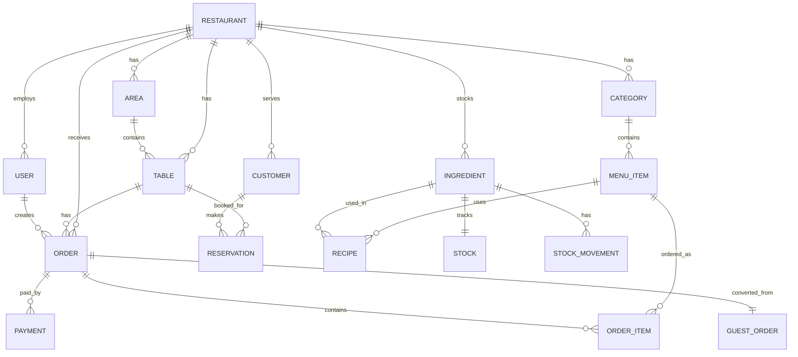

# RMS POS Sistemi - Modül Analizi ve Öneriler

## 📊 Mevcut Modül Yapısı

### Backend Modülleri (15 adet)

| Modül | Durum | Açıklama |
|-------|-------|----------|
| [`auth`](backend/src/modules/auth/) | ✅ Aktif | JWT tabanlı kimlik doğrulama, Local & JWT stratejileri |
| [`users`](backend/src/modules/users/) | ✅ Aktif | Kullanıcı yönetimi (CRUD) |
| [`restaurants`](backend/src/modules/restaurants/) | ✅ Aktif | Restoran yönetimi, sahip ilişkisi |
| [`tables`](backend/src/modules/tables/) | ✅ Aktif | Masa ve alan yönetimi, QR kod desteği |
| [`menus`](backend/src/modules/menus/) | ✅ Aktif | Kategori ve menü öğesi yönetimi |
| [`orders`](backend/src/modules/orders/) | ✅ Aktif | Sipariş yönetimi, durum takibi, masa taşıma |
| [`payments`](backend/src/modules/payments/) | ✅ Aktif | Ödeme işlemleri, indirim desteği, çoklu ödeme yöntemi |
| [`inventory`](backend/src/modules/inventory/) | ✅ Aktif | Malzeme, stok, reçete yönetimi, stok hareketleri |
| [`customers`](backend/src/modules/customers/) | ✅ Aktif | Müşteri yönetimi, sadakat takibi |
| [`reservations`](backend/src/modules/reservations/) | ✅ Aktif | Rezervasyon yönetimi |
| [`qr-guest`](backend/src/modules/qr-guest/) | ✅ Aktif | Misafir sipariş sistemi, WebSocket entegrasyonu |
| [`notifications`](backend/src/modules/notifications/) | ✅ Aktif | WebSocket gateway, gerçek zamanlı bildirimler |
| [`analytics`](backend/src/modules/analytics/) | ✅ Aktif | Dashboard metrikleri, satış analizi |
| [`reports`](backend/src/modules/reports/) | ✅ Aktif | Satış, stok ve finans raporları |
| [`audit`](backend/src/modules/audit/) | ✅ Aktif | Denetim kayıtları, değişiklik takibi |
| [`files`](backend/src/modules/files/) | ✅ Aktif | Dosya yükleme ve yönetimi |

### Frontend Modülleri (13 adet)

| Modül | Durum | Açıklama |
|-------|-------|----------|
| [`auth`](frontend/modules/auth/) | ✅ Aktif | Giriş formu, auth hook'ları |
| [`dashboard`](frontend/modules/dashboard/) | ✅ Aktif | Ana panel, grafikler (HourlySalesChart, OccupancyChart) |
| [`operations`](frontend/modules/operations/) | ✅ Aktif | Operasyon ekranı, masa kartları, alan sekmeleri |
| [`orders`](frontend/modules/orders/) | ✅ Aktif | POS arayüzü, sipariş kartları, masa taşıma |
| [`payments`](frontend/modules/payments/) | ✅ Aktif | Ödeme modalı |
| [`menus`](frontend/modules/menus/) | ✅ Aktif | Kategori ve menü öğesi formları |
| [`inventory`](frontend/modules/inventory/) | ✅ Aktif | Malzeme, reçete, stok hareketi yönetimi |
| [`tables`](frontend/modules/tables/) | ✅ Aktif | Masa ve alan yönetimi, QR yazdırma |
| [`customers`](frontend/modules/customers/) | ✅ Aktif | Müşteri modalı |
| [`reservations`](frontend/modules/reservations/) | ✅ Aktif | Rezervasyon modalı ve uyarıları |
| [`qr-guest`](frontend/modules/qr-guest/) | ✅ Aktif | Misafir sayfası, sepet, sipariş takibi |
| [`reports`](frontend/modules/reports/) | ✅ Aktif | Rapor sayfası, grafikler, tarih seçici |
| [`settings`](frontend/modules/settings/) | ✅ Aktif | Ayarlar, denetim kayıtları |
| [`shared`](frontend/modules/shared/) | ✅ Aktif | Ortak bileşenler, API istemcisi, yardımcılar |

---

## 🏗️ Veritabanı Varlık İlişki Diyagramı



---

## ✅ Güçlü Yönler (Mevcut Sistem)

### 1. **Kapsamlı Temel Özellikler**
- ✅ Sipariş yönetimi (durum makinesi: pending → preparing → ready → served → paid)
- ✅ Çoklu ödeme yöntemi (nakit, kredi kartı)
- ✅ Stok ve envanter takibi (malzeme → reçete → ürün)
- ✅ QR kod ile misafir siparişi
- ✅ Rezervasyon sistemi
- ✅ Müşteri sadakat takibi

### 2. **Teknik Altyapı**
- ✅ NestJS + TypeScript backend (modüler mimari)
- ✅ TypeORM ile ilişkisel veritabanı
- ✅ WebSocket (Socket.io) gerçek zamanlı iletişim
- ✅ JWT tabanlı kimlik doğrulama ve rol bazlı yetkilendirme
- ✅ Audit logging (değişiklik takibi)
- ✅ Redis cache desteği

### 3. **Raporlama ve Analitik**
- ✅ Dashboard metrikleri (doluluk oranı, günlük ciro)
- ✅ Saatlik satış grafikleri
- ✅ Satış, stok ve finans raporları

---

## ⚠️ Eksik Modüller ve Özellikler

### 🔴 KRİTİK Eksikler (Acil)

| Modül | Önem | Açıklama | İş Değeri |
|-------|------|----------|-----------|
| **Vardiya (Shift) Yönetimi** | 🔴 Yüksek | Garson vardiya takibi, kasa açılış/kapanış | Zorunlu - Kasa mutabakatı için gerekli |
| **Fatura/Fiş Yönetimi** | 🔴 Yüksek | Yazıcı entegrasyonu, fiziksel fiş/fatura | Yasal zorunluluk |
| **İndirim/Kampanya Sistemi** | 🔴 Yüksek | Manuel ve otomatik indirim kuralları | Satış artışı |

### 🟡 ÖNEMLİ Eksikler (Orta Vadeli)

| Modül | Önem | Açıklama | İş Değeri |
|-------|------|----------|-----------|
| **Satın Alma (Procurement)** | 🟡 Orta | Tedarikçi yönetimi, sipariş verme | Maliyet kontrolü |
| **Personel Yönetimi** | 🟡 Orta | Çalışan izinleri, vardiya planlama, saatlik ücret | İK yönetimi |
| **Gider Yönetimi** | 🟡 Orta | Fatura, kira, maaş gibi işletme giderleri | Karlılık analizi |
| **Paket Sipariş (Delivery)** | 🟡 Orta | Online paket sipariş yönetimi | Gelir çeşitliliği |
| **Mutfak Ekranı (KDS)** | 🟡 Orta | Mutfak için sipariş görüntüleme ekranı | Operasyon verimliliği |

### 🟢 İYİLEŞTİRME Önerileri (Uzun Vadeli)

| Özellik | Önem | Açıklama |
|---------|------|----------|
| **Çoklu Şube Desteği** | 🟢 Düşük | Zincir restoranlar için merkezi yönetim |
| **Sadakat Programı** | 🟢 Düşük | Puan sistemi, özel indirimler |
| **Masaüstü Uygulama (Electron)** | 🟢 Düşük | Offline çalışma, yerel yazıcı desteği |
| **Mobil Garson Uygulaması** | 🟢 Düşük | Tablet/telefondan sipariş alma |

---

## 📋 Detaylı Eksik Modül Analizi

### 1. Vardiya (Shift) Modülü ⏰

**Neden Gerekli?**
- Kasa açılış/kapanış tutarlarının takibi
- Garson performans ölçümü (sipariş sayısı, ciro)
- Güvenlik ve denetim için zorunlu

**İçerik Önerisi:**
```typescript
// entities/shift.entity.ts
- id, user_id, restaurant_id
- opened_at, closed_at
- opening_cash, expected_cash, actual_cash
- difference_amount, difference_reason
- status: OPEN | CLOSED
```

**Endpoint'ler:**
- `POST /shifts/open` - Vardiya aç
- `POST /shifts/:id/close` - Vardiya kapat
- `GET /shifts/current` - Aktif vardiya
- `GET /shifts/report` - Vardiya raporu

---

### 2. Fatura/Fiş Modülü 🧾

**Neden Gerekli?**
- Yasal zorunluluk (vergi kaydı)
- Müşteriye fiziksel belge sunma
- İade işlemleri için referans

**İçerik Önerisi:**
```typescript
// entities/invoice.entity.ts
- id, order_id, payment_id
- invoice_number, type: RECEIPT | INVOICE
- tax_amount, total_amount
- customer_name, tax_number (e-fatura için)
- printed_at, digital_copy_url
```

**Özellikler:**
- Termal yazıcı entegrasyonu (ESC/POS)
- E-fatura entegrasyonu (GIB)
- Fiş şablonu özelleştirme
- Yeniden yazdırma

---

### 3. Kampanya/İndirim Modülü 🏷️

**Neden Gerekli?**
- Satışları artırmak için promosyonlar
- Sadık müşterilere özel fırsatlar
- Sezonluk kampanyalar

**İçerik Önerisi:**
```typescript
// entities/campaign.entity.ts
- id, name, description
- type: PERCENTAGE | FIXED | BOGO | BUNDLE
- discount_value, min_order_amount
- applicable_items (JSON array)
- start_date, end_date
- usage_limit, usage_count
- is_active
```

**Kampanya Tipleri:**
- Yüzde indirim (%10)
- Sabit indirim (50 TL)
- Alana bedava (2 al 1 öde)
- Paket kampanyası (menü fiyatı)
- İlk sipariş indirimi
- Doğum günü indirimi

---

### 4. Satın Alma (Procurement) Modülü 📦

**Neden Gerekli?**
- Malzeme maliyetlerini kontrol altında tutma
- Tedarikçi karşılaştırması
- Otomatik sipariş önerileri

**İçerik Önerisi:**
```typescript
// entities/supplier.entity.ts
- id, name, contact_person, phone, email
- address, tax_number, payment_terms

// entities/purchase-order.entity.ts
- id, supplier_id, restaurant_id
- order_date, expected_date, received_date
- status: DRAFT | SENT | CONFIRMED | RECEIVED | CANCELLED
- total_amount

// entities/purchase-order-item.entity.ts
- purchase_order_id, ingredient_id
- quantity, unit_price, total_price
- received_quantity
```

---

### 5. Mutfak Ekranı (KDS - Kitchen Display System) 👨‍🍳

**Neden Gerekli?**
- Siparişlerin mutfakta görünürlüğü
- Hazırlama süresi takibi
- Öncelik yönetimi

**Özellikler:**
- Sesli bildirim (yeni sipariş)
- Renk kodlu siparişler (bekleme süresine göre)
- Hazırlandı işaretleme
- İptal bildirimleri
- Performans metrikleri (ortalama hazırlama süresi)

---

### 6. Gider Yönetimi Modülü 💸

**Neden Gerekli?**
- Gerçek karlılık analizi
- Maliyet kontrolü
- Bütçe planlaması

**İçerik Önerisi:**
```typescript
// entities/expense.entity.ts
- id, restaurant_id, category_id
- amount, date, description
- receipt_url, is_recurring
- created_by

// entities/expense-category.entity.ts
- id, name: RENT | UTILITIES | SALARIES | SUPPLIES | MAINTENANCE | OTHER
```

---

## 🎯 Önceliklendirme Önerisi

### Faz 1: Temel İşlevler (1-2 Ay)
1. ✅ Vardiya Modülü (Kasa mutabakatı için kritik)
2. ✅ Fatura/Fiş Yazdırma (Yasal zorunluluk)
3. ✅ Kampanya/İndirim Sistemi

### Faz 2: Operasyonel İyileştirmeler (2-3 Ay)
4. Mutfak Ekranı (KDS)
5. Paket Sipariş Yönetimi
6. Gider Yönetimi

### Faz 3: İleri Seviye (3-6 Ay)
7. Satın Alma Modülü
8. Personel Yönetimi (vardiya planlama)
9. Sadakat Programı

---

## 📊 Mevcut Sistem Değerlendirmesi

| Kategori | Puan | Yorum |
|----------|------|-------|
| **Temel POS Özellikleri** | 8/10 | Sipariş, ödeme, stok güçlü. Vardiya ve fiş eksik. |
| **Raporlama** | 7/10 | Temel raporlar var. Gelişmiş analitik eklenebilir. |
| **Kullanıcı Deneyimi** | 7/10 | Modern UI. Bazı kullanıcı akışları iyileştirilebilir. |
| **Teknik Altyapı** | 9/10 | NestJS, WebSocket, Redis ile sağlam mimari. |
| **Ölçeklenebilirlik** | 8/10 | Modüler yapı, çoklu restoran desteği hazır. |
| **Entegrasyon** | 6/10 | Yazıcı ve ödeme gateway entegrasyonu eksik. |

**Genel Değerlendirme: 7.5/10**

---

## 💡 Hızlı Kazanımlar (Quick Wins)

1. **Fiş Şablonu** - Basit termal yazıcı desteği ekle
2. **Vardiya Raporu** - Mevcut verilerle basit vardiya takibi
3. **İndirim Butonu** - POS ekranına hızlı indirim butonları
4. **Mutfak Bildirimi** - WebSocket ile mutfağa anlık bildirim
5. **Otomatik Yedekleme** - Veritabanı yedekleme schedule'ı

---

## Sonuç

Mevcut RMS POS sisteminiz **güçlü bir temele** sahip. Temel işlevler (sipariş, ödeme, stok, rezervasyon) çalışır durumda. Ancak **canlı ortamda kullanım için** aşağıdaki modüllerin eklenmesi şart:

### 🚨 Mutlaka Eklenmeli:
1. **Vardiya Modülü** - Kasa kontrolü ve personel takibi için
2. **Fatura/Fiş Yazdırma** - Yasal zorunluluk ve müşteri deneyimi
3. **Kampanya Sistemi** - Rekabetçi fiyatlandırma ve promosyonlar

Bu üç modül eklendikten sonra sistem **canlı ortama hazır** hale gelir. Diğer modüller iş büyümesine paralel olarak eklenebilir.
