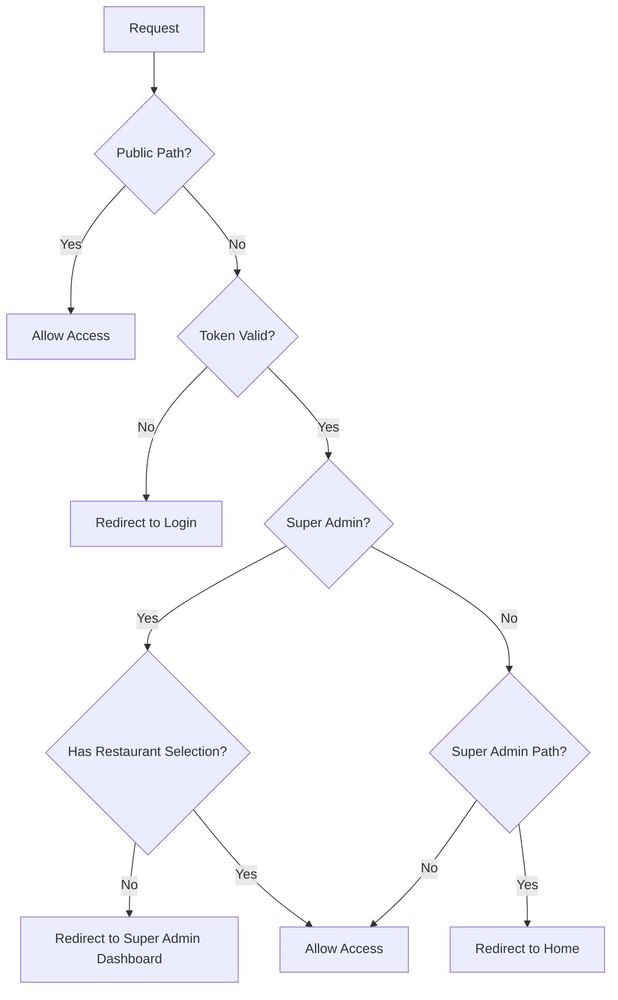
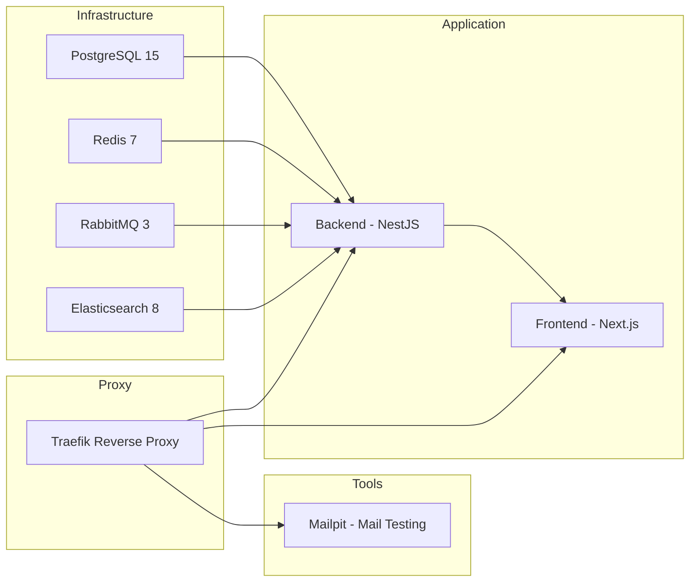

# Restaurant Management System - Proje Yapisi Analizi

## Genel Bakis

Bu proje, Next.js 14 App Router ve NestJS backend kullanilarak gelistirilmis modüler bir restoran yonetim sistemidir. Docker ile containerize edilmis ve Traefik reverse proxy ile yonetilmektedir.

---

## Proje Dizin Yapisi

```
restaruant-management-system/
ââââ backend/                 # NestJS Backend API
ââââ frontend/                # Next.js Frontend
ââââ docker/                  # Docker yapilandirmalari
ââââ agents/                  # AI agent yapilandirmalari
ââââ .agent/                   # Agent cache
ââââ Makefile                  # Merkezi komut yonetimi
ââââ README.md
ââââ plans/                    # Planlama dokümanlari
```

---

## Frontend Yapisi - Next.js 14 App Router

### Dizin Organizasyonu

```
frontend/
ââââ app/                      # Next.js App Router
ââ   ââââ (auth)/              # Auth route group
ââ   ââ   ââââ login/          # Login sayfasi
ââ   ââââ (guest)/             # Guest/QR route group
ââ   ââ   ââââ guest/          # QR kod ile erisim
ââ   ââ       ââââ menu/       # Müsteri menü görüntüleme
ââ   ââ       ââââ orders/    # Müsteri siparis takibi
ââ   ââ       ââââ debug/      # Debug sayfalari
ââ   ââââ (main)/              # Ana uygulama route group
ââ   ââ   ââââ dashboard/      # Dashboard
ââ   ââ   ââââ orders/         # Siparis yonetimi
ââ   ââ   ââââ pos/            # POS interface
ââ   ââ   ââââ menus/          # Menü yonetimi
ââ   ââ   ââââ inventory/      # Envanter yonetimi
ââ   ââ   ââââ customers/      # Müsteri yonetimi
ââ   ââ   ââââ tables/         # Masa yonetimi
ââ   ââ   ââââ payments/       # Ödeme yonetimi
ââ   ââ   ââââ cash/           # Kasa yonetimi
ââ   ââ   ââââ reports/        # Raporlar
ââ   ââ   ââââ reservations/   # Rezervasyonlar
ââ   ââ   ââââ notifications/  # Bildirimler
ââ   ââ   ââââ settings/       # Ayarlar
ââ   ââ   ââââ operations/     # Operasyonlar
ââ   ââ   ââââ takeaway/       # Paket servis
ââ   ââ   ââââ waiter/         # Garson modülü
ââ   ââââ (super-admin)/       # Super Admin route group
ââ   ââ   ââââ super-admin/
ââ   ââ       ââââ dashboard/    # Super admin dashboard
ââ   ââ       ââââ restaurants/  # Restoran yonetimi
ââ   ââ       ââââ users/        # Kullanici yonetimi
ââ   ââ       ââââ rules/        # Is kurallari
ââ   ââ       ââââ settings/     # Sistem ayarlari
ââ   ââââ globals.css
ââ   ââââ layout.tsx           # Root layout
ââ   ââââ providers.tsx        # Context providers
ââââ modules/                  # Modüler bileþenler
ââ   ââââ auth/                # Kimlik dogrulama
ââ   ââââ orders/              # Siparis modülü
ââ   ââââ menus/               # Menü modülü
ââ   ââââ inventory/           # Envanter modülü
ââ   ââââ customers/           # Müsteri modülü
ââ   ââââ tables/              # Masa modülü
ââ   ââââ payments/            # Ödeme modülü
ââ   ââââ cash/                # Kasa modülü
ââ   ââââ reports/             # Rapor modülü
ââ   ââââ reservations/        # Rezervasyon modülü
ââ   ââââ notifications/       # Bildirim modülü
ââ   ââââ settings/            # Ayarlar modülü
ââ   ââââ operations/          # Operasyon modülü
ââ   ââââ restaurants/         # Restoran modülü
ââ   ââââ users/               # Kullanici modülü
ââ   ââââ dashboard/           # Dashboard modülü
ââ   ââââ company/             # Sirket modülü
ââ   ââââ qr-guest/            # QR Guest modülü
ââ   ââââ shared/              # Paylasilan bileþenler
ââââ components/               # Global bileþenler
ââ   ââââ super-admin/        # Super admin bileþenleri
ââââ lib/                      # Yardimci kutuphaneler
ââ   ââââ api/                 # API istemcileri
ââ   ââââ validations/         # Zod semalari
ââââ middleware.ts             # Auth middleware
```

### Modüler Yapý Organizasyonu

Her modül asagidaki yapýya sahiptir:

```
modules/[module-name]/
ââââ types.ts              # TypeScript tip tanimlari
ââââ service.ts            # API servis fonksiyonlari
ââââ components/           # Modül bileþenleri
ââ   ââââ [Component].tsx
ââââ hooks/                # Custom hooks - opsiyonel
ââââ context/              # React context - opsiyonel
ââââ schemas.ts            # Zod validation semalari - opsiyonel
```

### Route Groups

| Route Group | Amaç | Erisim |
|-------------|------|--------|
| `(auth)` | Kimlik dogrulama sayfalari | Public |
| `(guest)` | QR kod ile müsteri erisimi | Public |
| `(main)` | Ana uygulama | Authenticated users |
| `(super-admin)` | Sistem yonetimi | Super admin only |

### Middleware Koruma Mantigi



---

## Backend Yapisi - NestJS

### Dizin Organizasyonu

```
backend/src/
ââââ modules/                  # Is modülleri
ââ   ââââ auth/                # Kimlik dogrulama
ââ   ââââ orders/              # Siparis yonetimi
ââ   ââââ menus/               # Menü yonetimi
ââ   ââââ inventory/           # Envanter yonetimi
ââ   ââââ customers/           # Müsteri yonetimi
ââ   ââââ tables/              # Masa yonetimi
ââ   ââââ payments/            # Ödeme yonetimi
ââ   ââââ cash/                # Kasa yonetimi
ââ   ââââ reports/              # Raporlar
ââ   ââââ reservations/        # Rezervasyonlar
ââ   ââââ notifications/       # Bildirimler
ââ   ââââ analytics/           # Analitik
ââ   ââââ audit/               # Denetim kayitlari
ââ   ââââ files/               # Dosya yonetimi
ââ   ââââ mail/                # E-posta servisleri
ââ   ââââ qr-guest/            # QR Guest
ââ   ââââ restaurants/         # Restoran yonetimi
ââ   ââââ rules/               # Is kurallari
ââ   ââââ super-admin/         # Super admin
ââ   ââââ users/               # Kullanici yonetimi
ââââ common/                   # Paylasilan kod
ââ   ââââ adapters/            # Adapter siniflari
ââ   ââââ config/              # Yapilandirma
ââ   ââââ databases/           # Veritabani yardimcilari
ââ   ââââ decorators/          # Custom decorators
ââ   ââââ dto/                 # Data transfer objects
ââ   ââââ entities/            # Base entity'ler
ââ   ââââ enums/               # Enum tanimlari
ââ   ââââ filters/             # Exception filters
ââ   ââââ guards/              # Auth guards
ââ   ââââ interceptors/        # Request/response interceptors
ââ   ââââ interfaces/          # Interface tanimlari
ââ   ââââ pipes/               # Validation pipes
ââ   ââââ services/            # Shared services
ââ   ââââ strategies/          # Passport strategies
ââ   ââââ utils/               # Yardimci fonksiyonlar
ââ   ââââ validators/          # Custom validators
ââââ config/                   # Uygulama yapilandirmasi
ââââ database/                 # Veritabani yapilandirmasi
ââ   ââââ seeds/               # Seed data
ââ   ââââ migrations/          # Migration dosyalari
ââââ migrations/               # Schema migrations
ââââ app.module.ts            # Ana modül
ââââ main.ts                   # Uygulama giris noktasi
```

### Modül Yapisi

Her modül asagidaki yapýya sahiptir:

```
modules/[module-name]/
ââââ [module].module.ts      # NestJS modül tanimi
ââââ [module].controller.ts  # HTTP endpoint'leri
ââââ [module].service.ts     # Is mantigi
ââââ dto/                    # Data transfer objects
ââ   ââââ create-[entity].dto.ts
ââ   ââââ update-[entity].dto.ts
ââ   ââââ get-[entity].dto.ts
ââââ entities/               # TypeORM entity'leri
ââ   ââââ [entity].entity.ts
ââââ enums/                  # Modül enum'lari
ââââ interfaces/             # Interface tanimlari
```

---

## Docker Altyapisi

### Servisler



### Container Yapilandirmasi

| Servis | Port | URL | Amaç |
|--------|------|-----|------|
| Frontend | 3001 | https://app.localhost | Next.js UI |
| Backend | 3000 | https://api.localhost | NestJS API |
| PostgreSQL | 5432 | - | Veritabani |
| Redis | 6379 | - | Cache/Pub-Sub |
| RabbitMQ | 15672 | https://rabbitmq.localhost | Message Queue |
| Elasticsearch | 9200 | https://es.localhost | Search Engine |
| Mailpit | 8025 | https://mail.localhost | Mail Testing |

---

## Make Komutlari

| Komut | Açiklama |
|-------|----------|
| `make dev` | Development ortamini baslat |
| `make dev-down` | Development ortamini durdur |
| `make build-dev` | Development image'larini build et |
| `make logs-dev` | Development loglarini goster |
| `make prod` | Production ortamini baslat |
| `make prod-down` | Production ortamini durdur |
| `make build-prod` | Production image'larini build et |
| `make logs-prod` | Production loglarini goster |
| `make ps` | Container durumunu goster |
| `make clean` | Temizlik islemleri |
| `make certs` | SSL sertifikalari olustur |
| `make start` | Alias for dev |
| `make stop` | Alias for dev-down |
| `make restart` | Development ortamini yeniden baslat |

---

## API Iletisim Yapisi

### HTTP Client

- **Axios** tabanli HTTP istemcisi
- **SSR ve Client** tarafinda farkli base URL'ler
- **Automatic token injection** - Cookie'den token otomatik eklenir
- **Error handling** - 401 durumunda otomatik login yönlendirmesi

### WebSocket

- **Socket.io** tabanli real-time iletiþim
- **Room-based** - Restoran bazli oda sistemi
- **Reconnection** - Otomatik yeniden baglanma

### API Endpoints

```
Base URL: /api/v1

Authentication:
  POST /auth/login

Orders:
  GET  /orders
  POST /orders
  PATCH /orders/:id/status
  PATCH /orders/:id/items

Menus:
  GET  /menus
  POST /menus/items
  PATCH /menus/items/:id

Inventory:
  GET  /inventory/ingredients
  POST /inventory/ingredients
  GET  /inventory/stock-movements

... ve diger modüller
```

---

## Frontend Teknolojileri

| Kategori | Teknoloji |
|----------|-----------|
| Framework | Next.js 14.2.5 |
| UI Library | React 18 |
| Styling | Tailwind CSS 3.4 |
| State Management | React Context |
| Form Handling | React Hook Form + Zod |
| HTTP Client | Axios |
| WebSocket | Socket.io Client |
| Charts | Recharts |
| Calendar | FullCalendar |
| Drag & Drop | @dnd-kit |
| Icons | Lucide React |
| Notifications | Sonner |
| Animation | Framer Motion |

---

## Backend Teknolojileri

| Kategori | Teknoloji |
|----------|-----------|
| Framework | NestJS 11 |
| Database | PostgreSQL 15 + TypeORM |
| Cache | Redis 7 |
| Message Queue | RabbitMQ 3 |
| Search | Elasticsearch 8 |
| Authentication | Passport.js + JWT |
| Validation | class-validator |
| API Docs | Swagger |
| Mail | Nodemailer |
| PDF/Excel | Puppeteer + ExcelJS |

---

## Özet

Bu proje modern bir restoran yonetim sistemi olarak asagidaki özellikleri sunmaktadir:

1. **Modüler Mimari** - Hem frontend hem backend modüler yapida
2. **Multi-tenant** - Super admin ile çoklu restoran destegi
3. **Real-time** - WebSocket ile anlik güncellemeler
4. **QR Guest** - Müsterilerin QR kod ile siparis vermesi
5. **POS** - Garson ve kasiyer için POS interface
6. **Inventory** - Envanter ve stok yonetimi
7. **Analytics** - Satis ve performans analizi
8. **Docker** - Containerize edilmis ortam
9. **Traefik** - Reverse proxy ve SSL sonlandirma

Proje, enterprise-level bir restoran yonetim sistemi için gerekli tüm bileþenleri içermektedir.