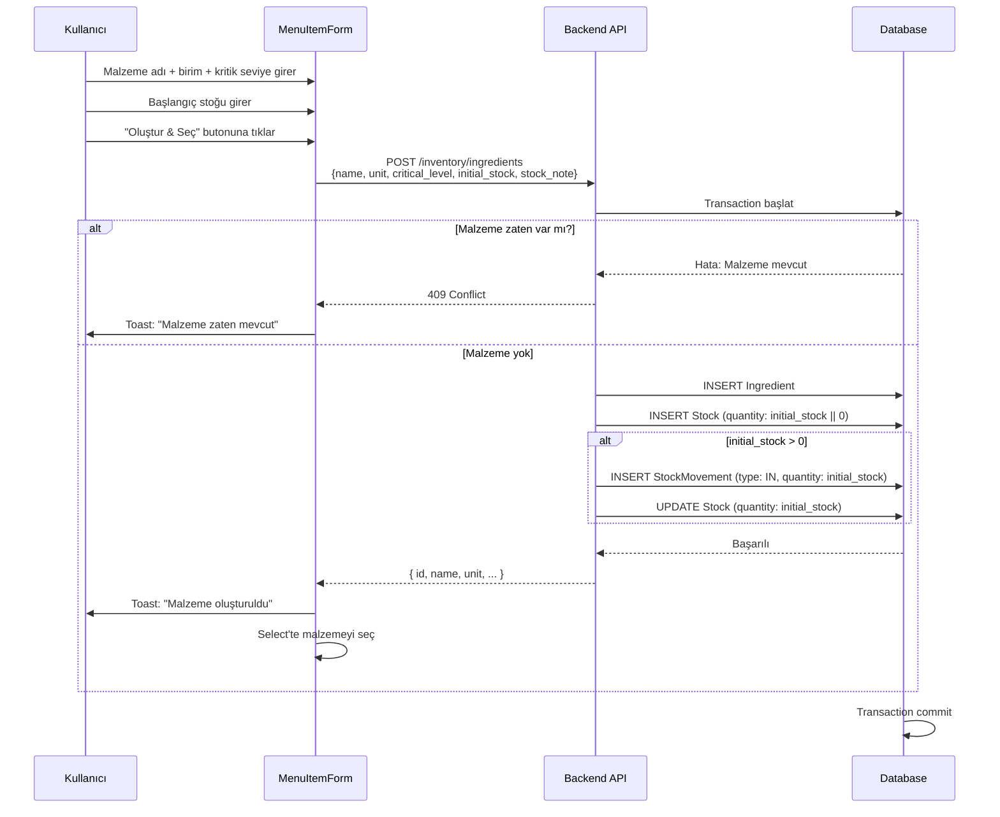

# Plan: Ürün Ekleme Sırasında Malzeme Stoku Ekleme

## Hedef
MenuItemForm'da yeni malzeme oluşturulurken, aynı anda o malzemenin başlangıç stoğu da girilsin ve stock hareketi (IN) kaydedilsin. Bu işlem transactional olsun - ya hep ya hiç.

---

## Mevcut Durum Analizi

### Backend Yapısı

| Entity | Dosya | Açıklama |
|--------|-------|-----------|
| `Ingredient` | `backend/src/modules/inventory/entities/ingredient.entity.ts` | Malzeme bilgileri (name, unit, critical_level, restaurant_id) |
| `Stock` | `backend/src/modules/inventory/entities/stock.entity.ts` | Malzeme stoğu (ingredient_id, quantity) |
| `StockMovement` | `backend/src/modules/inventory/entities/stock-movement.entity.ts` | Stok hareketleri (IN, OUT, ADJUST) |

### Frontend Yapısı

| Dosya | Açıklama |
|--------|-----------|
| `frontend/modules/menus/components/MenuItemForm.tsx` | Ürün ekleme/düzenleme formu |
| `frontend/modules/inventory/types.ts` | Malzeme tipleri |

---

## Değişiklik Planı

### 1. Backend: CreateIngredientDto'ya initial_stock Ekleme

**Dosya:** `backend/src/modules/inventory/dto/create-ingredient.dto.ts`

```typescript
export class CreateIngredientDto {
  // ... mevcut alanlar ...

  // YENİ ALAN - Başlangıç stoğu
  @ApiPropertyOptional({ example: 10 })
  @IsNumber()
  @IsOptional()
  @Min(0)
  initial_stock?: number;

  // YENİ ALAN - Stok notu
  @ApiPropertyOptional({ example: 'İlk stok' })
  @IsString()
  @IsOptional()
  stock_note?: string;
}
```

### 2. Backend: InventoryService.createIngredient Güncelleme

**Dosya:** `backend/src/modules/inventory/inventory.service.ts`

- `initial_stock` ve `stock_note` parametrelerini al
- Ingredient ve Stock kaydetme işlemini transaction içinde yap
- Eğer `initial_stock > 0` ise, StockMovement kaydı oluştur (`MovementType.IN`)

**İşlem Akışı:**
```
1. Transaction başlat
2. Ingredient INSERT
3. Stock INSERT (quantity: 0)
4. Eğer initial_stock > 0 ise:
   a. StockMovement kaydı INSERT (type: IN, quantity: initial_stock)
   b. Stock kaydını BUL ve quantity'yu initial_stock olarak UPDATE et
5. Transaction commit veya rollback
```

> **ÖNEMLI:** Stock tablosunda UPDATE yapılırken mevcut kayıt güncellenir, INSERT değil. Geçmişe dönük kayıtlar StockMovement tablosunda korunur.

### 3. Backend: MenusService Güncelleme (Opsiyonel)

Eğer menus modülünden inventory'ye erişim varsa, direkt olarak ingredient oluştururken stock ekleme yapılabilir. Ancak mevcut yapıda zaten inventoryApi kullanılıyor, bu yüzden frontend inventoryApi'ye yönlendirilecek.

### 4. Frontend: MenuItemForm'da Stok Girişi Ekleme

**Dosya:** `frontend/modules/menus/components/MenuItemForm.tsx`

Inline malzeme oluşturma formuna yeni alanlar ekle:

```tsx
// Yeni state'ler
const [newIngredientInitialStock, setNewIngredientInitialStock] = useState(0);
const [newIngredientStockNote, setNewIngredientStockNote] = useState('');

// Form alanlarına ekle
<div className="grid grid-cols-4 gap-2">  {/* unit + critical + stock + note */}
    {/* ... mevcut alanlar ... */}
    <div className="space-y-1">
        <label className="text-[10px] font-medium text-white/40 ml-1">Başlangıç Stok</label>
        <Input
            type="number"
            placeholder="0"
            value={newIngredientInitialStock}
            onChange={(e) => setNewIngredientInitialStock(Number(e.target.value))}
            className="h-9 text-xs"
        />
    </div>
    <div className="space-y-1">
        <label className="text-[10px] font-medium text-white/40 ml-1">Stok Notu</label>
        <Input
            placeholder="Not..."
            value={newIngredientStockNote}
            onChange={(e) => setNewIngredientStockNote(e.target.value)}
            className="h-9 text-xs"
        />
    </div>
</div>
```

### 5. Frontend: inventoryApi.createIngredient Güncelleme

**Dosya:** `frontend/modules/inventory/service.ts`

```typescript
createIngredient: async (data: {
    name: string;
    unit: string;
    critical_level: number;
    restaurant_id: string;
    initial_stock?: number;
    stock_note?: string;
}) => {
    return http.post<Ingredient>('/inventory/ingredients', data);
},
```

---

## Mermaid Akış Diyagramı



---

## Öncelik Sırası

| # | Adım | Öncelik | Açıklama |
|---|------|---------|-----------|
| 1 | Backend: CreateIngredientDto güncelleme | Yüksek | DTO'ya initial_stock alanı ekle |
| 2 | Backend: InventoryService güncelleme | Yüksek | Transactional stock movement ekleme |
| 3 | Frontend: inventoryApi güncelleme | Orta | initial_stock parametresi ekle |
| 4 | Frontend: MenuItemForm güncelleme | Orta | Stok girişi form alanı ekle |
| 5 | Test | Orta | Entegrasyon testi |

---

## Notlar

1. **Stok Düşme:** Kullanıcı "malzeme bazlı stock düşmeden vazgeçmeyelim" dedi, bu özellik zaten mevcut - sipariş verildiğinde recipe'lara göre malzeme düşülüyor (`decreaseStockForOrder`)

2. **current_stock:** Kullanıcı bunu kullanmak istemiyor, sadece ingredient-stock sistemi kullanılacak

3. **Transaction:** Her iki kayıt (ingredient + stock + stock_movement) tek transaction içinde olmalı - biri başarısız olursa hepsi rollback edilmeli
