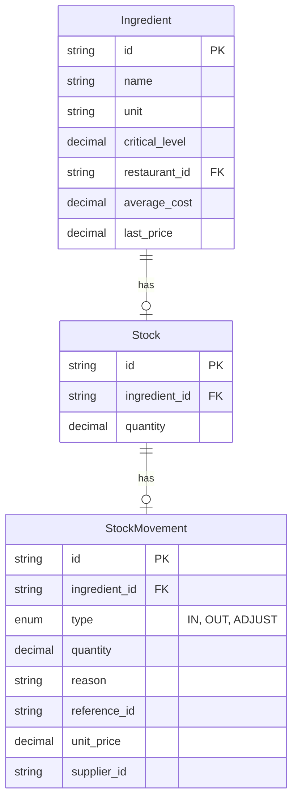
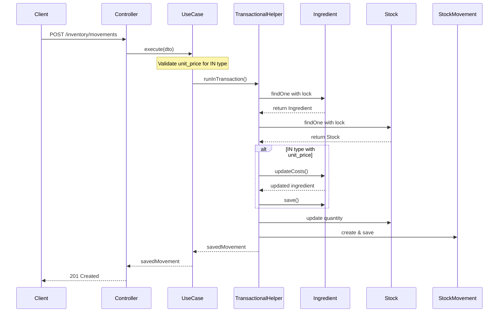

# Stok Hareketi Maliyet Güncelleme - Uygulama Planı

## Genel Bakış

Bu plan, NestJS ile geliştirilen RMS projesinde stok hareketleri kaydedildiğinde malzemelerin ortalama maliyetini ve son alış fiyatını güncelleyen DDD uyumlu mantığın nasıl ekleneceğini detaylandırır.

---

## Mevcut Durum Analizi

### Mevcut Entity Yapısı



### Maliyet Alanları Durumu

| Alan | Durum | Açıklama |
|------|-------|-----------|
| `Ingredient.average_cost` | ✅ Var | Ortalama maliyet |
| `Ingredient.last_price` | ✅ Var | Son alış fiyatı |
| `StockMovement.unit_price` | ✅ Var | Birim fiyat (giriş hareketlerinde) |

---

## Uygulama Adımları

### Adım 1: Ingredient Entity'ye Domain Metodu Ekleme

**Dosya**: `backend/src/modules/inventory/entities/ingredient.entity.ts`

**Değişiklik**: `updateCosts()` metodu eklenecek

```typescript
/**
 * Malzeme maliyetlerini güncelleyen domain metodu
 * 
 * Formül:
 * - Eğer mevcut stok ve maliyet 0 ise: yeni fiyat = ortalama maliyet
 * - Eğer stok varsa: ((mevcutStok * ortalamaMaliyet) + (yeniMiktar * yeniFiyat)) / (mevcutStok + yeniMiktar)
 * - last_price her zaman yeni birim fiyatı ile güncellenir
 */
updateCosts(newQuantity: number, newUnitPrice: number, currentStockQuantity: number): void {
  // Sıfıra bölünme kontrolü
  if (currentStockQuantity + newQuantity === 0) {
    return;
  }

  const currentAverageCost = Number(this.average_cost) || 0;
  const currentStock = Number(currentStockQuantity);

  if (currentStock === 0 && currentAverageCost === 0) {
    // İlk giriş - direkt yeni fiyatı ortalama maliyet yap
    this.average_cost = newUnitPrice;
  } else if (currentStock > 0) {
    // Ağırlıklı ortalama hesaplama
    const totalCost = (currentStock * currentAverageCost) + (newQuantity * newUnitPrice);
    const totalQuantity = currentStock + newQuantity;
    this.average_cost = totalCost / totalQuantity;
  }

  // last_price her zaman güncellenir
  this.last_price = newUnitPrice;
}
```

**Kurallar**:
- Domain mantığı entity içinde yer almalı (DDD)
- Formül: `((mevcutStok * ortalamaMaliyet) + (yeniMiktar * yeniFiyat)) / (mevcutStok + yeniMiktar)`
- `last_price` her zaman `newUnitPrice` ile güncellenir
- Sıfıra bölünme kontrolü yapılmalı

---

### Adım 2: CreateStockMovementDto Validasyon Güncelleme

**Dosya**: `backend/src/modules/inventory/dto/create-stock-movement.dto.ts`

**Değişiklik**: `unit_price` sadece IN hareketlerinde zorunlu/izinli olmalı

```typescript
import {
  IsString,
  IsNotEmpty,
  IsNumber,
  IsEnum,
  IsOptional,
  Min,
  ValidateIf,
} from 'class-validator';
import { MovementType } from '../entities/stock-movement.entity';
import { ApiProperty, ApiPropertyOptional } from '@nestjs/swagger';

export class CreateStockMovementDto {
  @ApiProperty({ description: 'Malzeme ID' })
  @IsString()
  @IsNotEmpty()
  ingredient_id: string;

  @ApiProperty({ enum: MovementType, description: 'Hareket tipi' })
  @IsEnum(MovementType)
  @IsNotEmpty()
  type: MovementType;

  @ApiProperty({ description: 'Miktar' })
  @IsNumber()
  @Min(0.001)
  @IsNotEmpty()
  quantity: number;

  @ApiPropertyOptional({ description: 'Hareket nedeni' })
  @IsString()
  @IsOptional()
  reason?: string;

  @ApiPropertyOptional({ description: 'Referans ID' })
  @IsString()
  @IsOptional()
  reference_id?: string;

  // unit_price sadece IN hareketlerinde izinli
  @ApiPropertyOptional({ description: 'Birim fiyat (sadece GİRİŞ hareketlerinde)' })
  @ValidateIf((o) => o.type === MovementType.IN)
  @IsNumber()
  @Min(0)
  @IsNotEmpty({ message: 'Giriş hareketleri için birim fiyat zorunludur' })
  unit_price?: number;

  @ApiPropertyOptional({ description: 'Tedarikçi ID' })
  @IsString()
  @IsOptional()
  supplier_id?: string;
}
```

**Kurallar**:
- `unit_price` sadece `MovementType.IN` olduğunda izin verilmeli
- IN hareketlerinde `unit_price` zorunlu olmalı
- Diğer hareket tiplerinde (OUT, ADJUST) `unit_price` yok sayılmalı

---

### Adım 3: CreateStockMovementUseCase Oluşturma

**Dosya**: `backend/src/modules/inventory/use-cases/create-stock-movement.use-case.ts`

**Yapı**:

```typescript
import {
  Injectable,
  NotFoundException,
  BadRequestException,
  Logger,
} from '@nestjs/common';
import { InjectRepository } from '@nestjs/typeorm';
import { Repository, QueryRunner } from 'typeorm';
import { Ingredient } from '../entities/ingredient.entity';
import { Stock } from '../entities/stock.entity';
import { StockMovement, MovementType } from '../entities/stock-movement.entity';
import { CreateStockMovementDto } from '../dto/create-stock-movement.dto';
import { TransactionalHelper } from '../../../common/databases/transactional.helper';

@Injectable()
export class CreateStockMovementUseCase {
  private readonly logger = new Logger(CreateStockMovementUseCase.name);

  constructor(
    @InjectRepository(Ingredient)
    private readonly ingredientRepository: Repository<Ingredient>,
    @InjectRepository(Stock)
    private readonly stockRepository: Repository<Stock>,
    @InjectRepository(StockMovement)
    private readonly movementRepository: Repository<StockMovement>,
    private readonly transactionalHelper: TransactionalHelper,
  ) {}

  async execute(dto: CreateStockMovementDto): Promise<StockMovement> {
    // Validation: unit_price sadece IN hareketlerinde izinli
    if (dto.type === MovementType.IN && !dto.unit_price) {
      throw new BadRequestException('Giriş hareketleri için birim fiyat zorunludur');
    }

    return this.transactionalHelper.runInTransaction(
      async (queryRunner: QueryRunner) => {
        // 1. Ingredient'i kilitli olarak çek
        const ingredient = await this.getIngredientWithLock(
          queryRunner,
          dto.ingredient_id,
        );

        // 2. Stock'u kilitli olarak çek
        const stock = await this.getStockWithLock(queryRunner, dto.ingredient_id);

        // 3. Yeni stok miktarını hesapla
        const newQuantity = this.calculateNewQuantity(
          Number(stock.quantity),
          dto.type,
          dto.quantity,
        );

        // Negatif stok kontrolü
        if (newQuantity < 0) {
          throw new BadRequestException('Stok miktarı negatif olamaz');
        }

        // 4. IN hareketi ise maliyetleri güncelle
        if (dto.type === MovementType.IN && dto.unit_price) {
          ingredient.updateCosts(dto.quantity, dto.unit_price, Number(stock.quantity));
          await queryRunner.manager.save(ingredient);
        }

        // 5. Stok miktarını güncelle
        stock.quantity = newQuantity;
        await queryRunner.manager.save(stock);

        // 6. Stok hareketini kaydet
        const movement = this.movementRepository.create({
          ...dto,
          quantity: dto.quantity, // Mutlak değer olarak kaydet
        });
        const savedMovement = await queryRunner.manager.save(movement);

        this.logger.log(
          `Stock movement created: ${savedMovement.id}, type: ${dto.type}, ` +
          `ingredient: ${ingredient.name}, quantity: ${dto.quantity}`,
        );

        return savedMovement;
      },
    );
  }

  // ===============================
  // PRIVATE HELPERS
  // ===============================

  private async getIngredientWithLock(
    queryRunner: QueryRunner,
    ingredientId: string,
  ): Promise<Ingredient> {
    const ingredient = await queryRunner.manager.findOne(Ingredient, {
      where: { id: ingredientId },
      lock: { mode: 'pessimistic_write' },
    });

    if (!ingredient) {
      throw new NotFoundException('Malzeme bulunamadı');
    }

    return ingredient;
  }

  private async getStockWithLock(
    queryRunner: QueryRunner,
    ingredientId: string,
  ): Promise<Stock> {
    const stock = await queryRunner.manager.findOne(Stock, {
      where: { ingredient_id: ingredientId },
      lock: { mode: 'pessimistic_write' },
    });

    if (!stock) {
      throw new NotFoundException('Stok kaydı bulunamadı');
    }

    return stock;
  }

  private calculateNewQuantity(
    currentQuantity: number,
    type: MovementType,
    movementQuantity: number,
  ): number {
    switch (type) {
      case MovementType.IN:
        return currentQuantity + movementQuantity;
      case MovementType.OUT:
        return currentQuantity - movementQuantity;
      case MovementType.ADJUST:
        return movementQuantity;
      default:
        return currentQuantity;
    }
  }
}
```

**Kurallar**:
- `TransactionalHelper.runInTransaction` kullanılmalı
- Pessimistic lock ile ingredient ve stock çekilmeli
- IN hareketi ve `unit_price` varsa `ingredient.updateCosts` çağrılmalı
- Tüm işlemler tek transaction içinde yapılmalı

---

### Adım 4: InventoryModule Güncelleme

**Dosya**: `backend/src/modules/inventory/inventory.module.ts`

```typescript
import { Module } from '@nestjs/common';
import { TypeOrmModule } from '@nestjs/typeorm';
import { InventoryService } from './inventory.service';
import { InventoryController } from './inventory.controller';
import { Ingredient } from './entities/ingredient.entity';
import { Stock } from './entities/stock.entity';
import { Recipe } from './entities/recipe.entity';
import { StockMovement } from './entities/stock-movement.entity';
import { CreateStockMovementUseCase } from './use-cases/create-stock-movement.use-case';
import { TransactionalHelper } from '../../common/databases/transactional.helper';

@Module({
  imports: [
    TypeOrmModule.forFeature([Ingredient, Stock, Recipe, StockMovement]),
  ],
  controllers: [InventoryController],
  providers: [InventoryService, CreateStockMovementUseCase, TransactionalHelper],
  exports: [InventoryService, CreateStockMovementUseCase],
})
export class InventoryModule {}
```

---

### Adım 5: Controller Güncelleme (Opsiyonel - UseCase'e Yönlendirme)

**Dosya**: `backend/src/modules/inventory/inventory.controller.ts`

Mevcut `addStockMovement` metodu `InventoryService.addStockMovement` yerine yeni UseCase'i kullanmalı:

```typescript
import { CreateStockMovementUseCase } from './use-cases/create-stock-movement.use-case';

// Constructor'a ekle
constructor(
  private readonly inventoryService: InventoryService,
  private readonly createStockMovementUseCase: CreateStockMovementUseCase,
) {}

// Metodu güncelle
@Post('movements')
@ApiOperation({ summary: 'Stok hareketi ekle (Giriş/Çıkış/Düzeltme)' })
addMovement(@Body(ValidationPipe) dto: CreateStockMovementDto) {
  return this.createStockMovementUseCase.execute(dto);
}
```

---

## Dosya Yapısı (Son Durum)

```
backend/src/modules/inventory/
├── inventory.module.ts              # Güncellenecek - UseCase eklenecek
├── inventory.service.ts             # Mevcut (değişiklik yok)
├── inventory.controller.ts          # Güncellenecek - UseCase'e yönlendirilecek
├── entities/
│   ├── ingredient.entity.ts         # Güncellenecek - updateCosts() eklenecek
│   ├── stock.entity.ts             # Değişiklik yok
│   ├── stock-movement.entity.ts    # Değişiklik yok
│   └── recipe.entity.ts            # Değişiklik yok
├── dto/
│   ├── create-ingredient.dto.ts    # Değişiklik yok
│   ├── create-stock-movement.dto.ts # Güncellenecek - validation eklenecek
│   ├── get-ingredients.dto.ts     # Değişiklik yok
│   └── get-stock-movements.dto.ts  # Değişiklik yok
├── enums/
│   └── stock-status.enum.ts       # Değişiklik yok
└── use-cases/
    └── create-stock-movement.use-case.ts  # YENİ - Oluşturulacak
```

---

## Test Senaryoları

### Birim Test (Unit Test)

```typescript
// ingredient.entity.spec.ts
describe('Ingredient.updateCosts', () => {
  let ingredient: Ingredient;

  beforeEach(() => {
    ingredient = new Ingredient();
    ingredient.average_cost = 0;
    ingredient.last_price = 0;
  });

  describe('updateCosts', () => {
    it('should set average_cost to new price when current stock and cost are 0', () => {
      ingredient.updateCosts(10, 100, 0);
      
      expect(ingredient.average_cost).toBe(100);
      expect(ingredient.last_price).toBe(100);
    });

    it('should calculate weighted average when stock exists', () => {
      ingredient.average_cost = 50; // 50 TL/kg
      ingredient.last_price = 50;
      
      // (100kg * 50TL) + (10kg * 100TL) / (100kg + 10kg) = 6000/110 = 54.54 TL/kg
      ingredient.updateCosts(10, 100, 100);
      
      expect(Number(ingredient.average_cost)).toBeCloseTo(54.54, 2);
      expect(ingredient.last_price).toBe(100);
    });

    it('should always update last_price', () => {
      ingredient.average_cost = 50;
      ingredient.last_price = 50;
      
      ingredient.updateCosts(5, 200, 100);
      
      expect(ingredient.last_price).toBe(200);
    });

    it('should handle zero quantity addition', () => {
      ingredient.average_cost = 50;
      ingredient.last_price = 50;
      
      ingredient.updateCosts(0, 100, 100);
      
      expect(ingredient.average_cost).toBe(50);
      expect(ingredient.last_price).toBe(100);
    });
  });
});
```

---

## Örnek Akış Diyagramı



---

## Sonraki Adımlar

1. **Code Mode'a Geçiş**: Plan onaylandıktan sonra code mode'a geçerek implementasyonu başlat
2. **Mevcut Service Entegrasyonu**: `InventoryService.addStockMovement` metodu yeni UseCase'e yönlendirilmeli veya kaldırılmalı
3. **API Dokümantasyonu**: Swagger annotation'ları güncellenmeli

---

## Riskler ve Dikkat Edilecekler

| Risk | Önlem |
|------|-------|
| Transaction başarısız olursa | Otomatik rollback sağlanıyor |
| Aynı anda birden fazla giriş | Pessimistic lock ile önleniyor |
| unit_price validation | DTO seviyesinde kontrol ediliyor |
| Sıfıra bölünme | Entity metodunda kontrol ediliyor |
