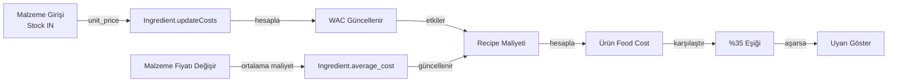

# RESTAU-RMS Teknik El Kitabı

> Bu doküman, RESTAU-RMS restoran yönetim sisteminin Inventory ve Products modüllerinin çalışma mantığını açıklar. Yeni bir yazılımcı veya sistem yöneticisi için hazırlanmıştır.

---

## İçindekiler

1. [Genel Bakış](#genel-bakış)
2. [Inventory Modülü](#inventory-modülü)
3. [Products Modülü](#products-modülü)
4. [Modüller Arası İlişkiler](#modüller-arası-i̇lişkiler)
5. [Kritik Sınırlar ve Uyarılar](#kritik-sınırlar-ve-uyarılar)
6. [Yapılandırma](#yapılandırma)

---

## Genel Bakış

RESTAU-RMS, restoran işletmeleri için geliştirilmiş kapsamlı bir yönetim sistemidir. Sistem iki ana veritabanı şeması üzerinde çalışır:

| Schema | Tablo Sayısı | Kullanım |
|--------|-------------|----------|
| `business` | ~15 | İşletme verileri (kullanıcılar, ürünler, siparişler) |
| `operations` | ~10 | Operasyonel veriler (malzemeler, stok hareketleri, reçeteler) |

---

## Inventory Modülü

### Modülün Amacı

Inventory modülü, restoranın hammaddelerini (malzemelerini) yönetir. Bu modül şunları sağlar:

- Malzeme CRUD işlemleri
- Stok takibi ve hareketleri
- Maliyet hesaplamaları (WAC - Ağırlıklı Ortalama Maliyet)
- Fiyat değişim analizi
- Kritik stok uyarıları
- Sayım farkı takibi

### Veri Yapısı

#### 1. Ingredient (Malzeme)

```sql
-- Tablo: operations.ingredients
-- Ana Alanlar:
name           | string  | Malzeme adı (örn: "Domates")
unit           | string  | Birim (kg, gr, lt, ml, adet, paket)
critical_level | decimal | Kritik stok seviyesi
average_cost   | decimal | Ağırlıklı ortalama maliyet (WAC)
last_price     | decimal | Son alış fiyatı
previous_price | decimal | Önceki fiyat (değişim analizi için)
price_updated_at| timestamp| Fiyat güncelleme tarihi
restaurant_id  | string  | Restoran ID (multi-tenant)
```

#### 2. Stock (Stok)

```sql
-- Tablo: operations.stocks
-- Ana Alanlar:
ingredient_id  | string  | İlişkili malzeme ID'si
quantity       | decimal | Mevcut stok miktarı
```

**Önemli:** Stock tablosu Ingredient ile **One-to-One** ilişkilidir. Her malzemenin tek bir stok kaydı vardır.

#### 3. StockMovement (Stok Hareketi)

```sql
-- Tablo: operations.stock_movements
-- Ana Alanlar:
ingredient_id  | string   | Malzeme ID
type           | enum    | Hareket tipi (IN, OUT, ADJUST)
quantity       | decimal | Miktar
reason         | string  | Neden (SALE, PURCHASE, WASTE, COUNT, ADJUSTMENT)
reference_id   | string  | Referans ID (sipariş ID, satın alma ID)
unit_price     | decimal | Birim fiyat (giriş hareketlerinde)
supplier_id    | string  | Tedarikçi ID
```

#### 4. Recipe (Reçete)

```sql
-- Tablo: operations.recipes
-- Ana Alanlar:
product_id     | string  | Ürün ID (business.menu_items)
ingredient_id  | string  | Malzeme ID (operations.ingredients)
quantity       | decimal | Kullanılan miktar
```

### Hesaplama Mantığı

#### 1. WAC (Weighted Average Cost - Ağırlıklı Ortalama Maliyet)

Malzeme girişi (Stock IN) yapıldığında otomatik olarak WAC hesaplanır:

```typescript
// Dosya: backend/src/modules/inventory/entities/ingredient.entity.ts
// Metod: updateCosts()

// Formül: ((mevcutStok * ortalamaMaliyet) + (yeniMiktar * yeniFiyat)) / (mevcutStok + yeniMiktar)

if (currentStock === 0 && currentAverageCost === 0) {
  // İlk giriş - direkt yeni fiyatı ortalama maliyet yap
  this.average_cost = newUnitPrice;
} else if (currentStock > 0) {
  // Ağırlıklı ortalama hesaplama
  const totalCost = (currentStock * currentAverageCost) + (newQuantity * newUnitPrice);
  const totalQuantity = currentStockQuantity + newQuantity;
  this.average_cost = totalCost / totalQuantity;
}
```

**Örnek:**
- Mevcut stok: 10 kg, WAC: 50 TL/kg
- Yeni giriş: 5 kg, 60 TL/kg
- Yeni WAC = ((10 × 50) + (5 × 60)) / (10 + 5) = (500 + 300) / 15 = 53.33 TL/kg

#### 2. Stok Durumu Hesaplama

```typescript
// Kritik seviye kontrolü (inventory.service.ts)
if (stockQuantity <= 0) {
  status = StockStatus.OUT_OF_STOCK;  // Stok tükendi
} else if (stockQuantity <= criticalLevel) {
  status = StockStatus.CRITICAL;       // Kritik seviyede
} else {
  status = StockStatus.HEALTHY;       // Yeterli stok
}
```

---

## Products Modülü

### Modülün Amacı

Products (Menus) modülü, restoranın menü ürünlerini yönetir. Bu modül şunları sağlar:

- Ürün CRUD işlemleri
- Kategori yönetimi
- Reçete (malzeme listesi) yönetimi
- Fiyatlandırma
- Stok takibi (opsiyonel)

### Veri Yapısı

#### 1. MenuItem (Ürün)

```sql
-- Tablo: business.menu_items
-- Ana Alanlar:
name           | string  | Ürün adı (örn: "Kıymalı Pizza")
description    | string  | Ürün açıklaması
price          | decimal | Satış fiyatı
image_url      | string  | Ürün görseli URL
is_available   | boolean | Satışta mı?
track_inventory| boolean | Stok takibi yapılsın mı?
popularity     | number  | Popülerlik skoru
category_id    | string  | Kategori ID
```

#### 2. Category (Kategori)

```sql
-- Tablo: business.categories
-- Ana Alanlar:
name           | string  | Kategori adı (örn: "İçecekler")
restaurant_id  | string  | Restoran ID
```

### Reçete Sistemi

Her ürünün bir veya daha fazla malzemesi olabilir (Recipe tablosu üzerinden):

```
MenuItem (Ürün)
    ↓ One-to-Many
Recipe (Reçete) → Ingredient (Malzeme)
    quantity: 0.5 (kg domates kullanılıyor)
```

---

## Modüller Arası İlişkiler

### Veri Akış Diyagramı



### Senaryo: Malzeme Fiyatı Artışı

1. **Malzeme girişi yapılır:** 10 kg domates, 40 TL/kg (eskiden 30 TL/kg)
2. **WAC hesaplanır:** `(mevcutStok × eskiWAC) + (yeniMiktar × yeniFiyat) / toplamMiktar`
3. **Reçete maliyeti güncellenir:** `domates × yeniWAC = yeniReçeteMaliyeti`
4. **Food Cost yeniden hesaplanır:** `(reçeteMaliyeti / satışFiyatı) × 100`
5. **Eğer %35'i aşarsa:** Sistem uyarı verir

### Senaryo: Ürün Satışı

1. **Sipariş oluşturulur:** 2 adet "Kıymalı Pizza"
2. **Reçete kontrolü:** Her pizza için gereken malzemeler hesaplanır
3. **Stok düşülür:** `StockMovement` (OUT tipi) kaydı oluşturulur
4. **Stock güncellenir:** `stocks.quantity` azaltılır

---

## Kritik Sınırlar ve Uyarılar

### 1. Kritik Stok Seviyesi

**Tanım:** Malzemenin stoğu kritik seviyenin altına düştüğünde verilen uyarı.

**Kod Konumu:** `backend/src/modules/inventory/inventory.service.ts`

```typescript
// Kritik seviye kontrolü
if (stockQuantity <= criticalLevel && stockQuantity > 0) {
  status = StockStatus.CRITICAL;  // Kritik seviyede
}
```

**Varsayılan Değer:** Her malzeme için ayrı ayrı tanımlanabilir (örn: 10 kg, 5 lt)

**Değiştirme:** Malzeme düzenleme formundan "Kritik Seviye" alanı güncellenir.

### 2. Food Cost %35 Eşiği

**Tanım:** Bir ürünün ham madde maliyetinin satış fiyatına oranı %35'i aştığında verilen uyarı.

**Formül:**

```
Food Cost % = (Reçete Maliyeti / Satış Fiyatı) × 100
```

**Örnek:**
- Domatesli Pizza fiyatı: 200 TL
- Domates, peynir, hamur, et toplam maliyeti: 80 TL
- Food Cost = (80 / 200) × 100 = %40 → **Uyarı verilir!**

**Önerilen Fiyat Hesaplama:**

```
Önerilen Fiyat = Reçete Maliyeti / (Hedef Food Cost / 100)
Önerilen Fiyat = 80 / (35 / 100) = 228.57 TL
```

**Kod Konumu:** `backend/src/modules/inventory/inventory.service.ts` (satır 573-598)

```typescript
const FOOD_COST_THRESHOLD = 35;  // %35 eşiği
const foodCostPercent = (recipeCost / productPrice) * 100;

if (foodCostPercent > FOOD_COST_THRESHOLD) {
  // Uyarı ekle
  const suggestedPrice = recipeCost / (FOOD_COST_THRESHOLD / 100);
}
```

### 3. Stok Tükenmesi (Out of Stock)

**Tanım:** Malzeme stoğu sıfır veya sıfırın altına düştüğünde.

```typescript
if (stockQuantity <= 0) {
  status = StockStatus.OUT_OF_STOCK;
}
```

### 4. Sayım Farkı (Count Difference)

**Tanım:** Yapılan fiziksel sayım ile sistemdeki stok arasındaki fark.

```sql
-- Örnek:
Sistemde: 100 kg domates
Sayımla:  95 kg domates
Fark:     -5 kg (kayıp/zayıf)
```

---

## Yapılandırma

### Kritik Stok Seviyesini Değiştirme

1. **Frontend üzerinden:**
   - Stok Yönetimi sayfasına gidin
   - Malzeme satırındaki düzenleme butonuna tıklayın
   - "Kritik Seviye" alanını güncelleyin
   - Kaydedin

2. **API üzerinden:**
   ```bash
   PATCH /api/v1/inventory/ingredients/{id}
   Body: { "critical_level": 20 }
   ```

### Food Cost Eşiğini Değiştirme

**Şu anda kod içinde sabit:** `%35`

**Kod Konumu:** `backend/src/modules/inventory/inventory.service.ts:573`

```typescript
const FOOD_COST_THRESHOLD = 35;  // Bu değeri değiştirin
```

**Gelecekte:** Bu değer veritabanından okunacak (yapılacak).

### Stok Durumu Filtreleme

**Mevcut Filtreler:**
- `ALL` - Tüm malzemeler
- `CRITICAL` - Kritik seviyedekiler (0 < quantity ≤ critical_level)
- `OUT_OF_STOCK` - Tükenenler (quantity ≤ 0)
- `HEALTHY` - Yeterli stok (quantity > critical_level)

---

## Sıkça Sorulan Sorular

### S: WAC neden önemli?
**C:** WAC (Ağırlıklı Ortalama Maliyet), farklı zamanlarda farklı fiyatlarla alınan malzemelerin ortalama maliyetini hesaplar. Bu sayede tek bir ürünün maliyetini daha doğru belirlersiniz.

### S: Reçetesi olmayan ürünün food cost'u hesaplanır mı?
**C:** Hayır, food cost analizi sadece reçetesi olan ürünler için yapılır.

### S: Stok hareketi silinirse ne olur?
**C:** Stok hareketleri silinirse, maliyetler eski haline geri dönmez. Bu yüzden düzeltme için yeni bir "ADJUST" hareketi oluşturulmalıdır.

### S: Kritik seviye 0 olarak ayarlanırsa ne olur?
**C:** Kritik seviye 0 olan malzemeler için "kritik stok" uyarısı verilmez.

---

## Son Güncelleme

- **Tarih:** 22 Şubat 2026
- **Sistem Versiyonu:** 1.0.0
- **Hazırlayan:** RESTAU-RMS Development Team
